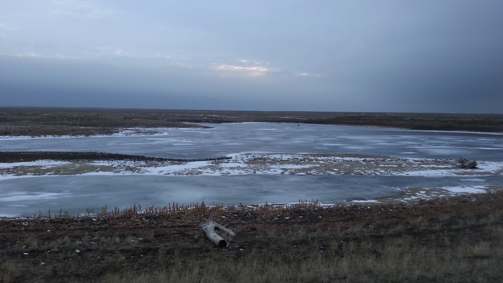

```{r setup, include=FALSE}
source("./R/setup.R")
```



## {- .tabset .tabset-fade .tabset-pills}

###  El Niño/La Niña {-}

Pacific sea surface temperatures have remained below average, maintaining La Niña conditions in the ocean and lower atmosphere. This typically results in wetter and cooler conditions during winter and spring in Montana. Early in the spring, the La Niña conditions are expected to contribute to below normal temperatures and above normal precipitation for portions of Montana. Most predictions agree that the La Niña will transition to ENSO neutral in late April to May. When ENSO neutral occurs, ocean temperatures and atmospheric conditions are close to the long term average and it is often more difficult to predict or forecast summer conditions.

#### Temperature {-}
```{r future-seasonal-enso-temp, fig.retina = 2, fig.align = "center", out.width = '100%', collapse=TRUE, results='hold', message=FALSE, warning=FALSE, cache=TRUE}


enso_temp <- mtd_plot_enso(months = 4:6,
                                element = "tmpc",
                                agg_fun = mean)
 
enso_temp$map
```

#### Precipitation {-}
```{r future-seasonal-enso-prcp, collapse=TRUE, results='hold', message=FALSE, warning=FALSE, cache=TRUE}

enso_prcp <- mtd_plot_enso(months = 4:6,
                                element = "pcpn",
                                agg_fun = sum)
 
enso_prcp$map
```


###  Temperature {-}

Because of the weakening La Niña, the spring forecast is for cooler than normal temperatures across eastern, central, and northwestern Montana. There are equal chances of above, below, or normal spring temperatures for the southwestern portions of the state. If the cooler than normal temperatures are realized for the majority of the state it may slow the warming of soil temperatures and delay the growing season and snowmelt.

```{r future-seasonal-temp, collapse=TRUE, results='hold', message=FALSE, warning=FALSE, cache=TRUE}

climdiv_tmpc <- climdiv_summary(months = 4:6,
                                year = 2017,
                                element = "tmpc",
                                agg_fun = mean)


noaa_seasonal <- mtd_plot_noaa_seasonal_forecast(date = "2018-04-01",
                                                 element = "temp",
                                                 data_out = "../data/NOAA_seasonal")

noaa_seasonal$map
```

###  Precipitation {-}
La Niña is weakening, but above normal precipitation is still forecast for northeastern and northcentral Montana. Here the polar jetstream is expected to continue bringing moisture from the north and could help relieve moisture deficits in Northeast Montana. Across the rest of the state, from southeastern to western Montana, the spring precipitation forecast is less certain and there are equal chances of above, below, or normal precipitation.

```{r future-seasonal-prcp, collapse=TRUE, results='hold', message=FALSE, warning=FALSE, cache=TRUE}

climdiv_pcpn <- climdiv_summary(months = 4:6,
                                year = 2017,
                                element = "pcpn",
                                agg_fun = sum)

noaa_seasonal <- mtd_plot_noaa_seasonal_forecast(date = "2018-04-01",
                                                 element = "prcp",
                                                 data_out = "../data/NOAA_seasonal")

noaa_seasonal$map

```

###  Drought {-}
Due to an above normal precipitation forecast for April through June, drought relief will likely come to the northeastern region of the Montana as spring continues.

```{r future-seasonal-drought, fig.retina = 2, fig.align = "center", out.width = '100%', collapse=TRUE, results='hold', message=FALSE, warning=FALSE, cache=TRUE}

future_seasonal_drought <- mtd_plot_noaa_drought_outlook(date = "2018-04-01",
                              data_out = "../data/NOAA_droughtlook")

future_seasonal_drought$map

```

