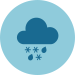

```{r setup, include=FALSE}
source("./R/setup.R")
```

## In a Word... {-}
Weather and climate forecasters use words and information in very particular ways that may be different from what we are accustomed to. Here is a list of terms we use in this newsletter:
  
<hr>

<div style="-webkit-columns: 3 250px;-moz-columns: 3 250px;columns: 3 250px;">
  {style="height:50px; margin:10px 10px; float:left;"}<br>**Normal(s)** --- Climatologists use "normal" to indicate values---weather measurements like temperature or amount of precipitation---that are expected to occur within a given area, based on past observations. Here, the "normal" value is the statistical mean value (average) for a given measurement over the past observations. Climatologists use the most recent 30-year period, rounded to the nearest decade, to define normal in North America: 1981--2010. The goal is to look far enough back in time to capture variation in weather patterns, but not so far as to be irrelevant to recent conditions. In 2021, we will start using the 1991--2020 period.
<!-- The median is the middle value among observed values when arranged from smallest to largest. 50 percent of the values are above the median, and 50 percent are below it. -->

<div style="float:left;">
{style="height:50px; margin:10px 10px; float:left;"}
<div class="clearfix"></div>
{style="height:50px; margin:10px 10px; float:left;"}
</div>
<br>**Temperature and Precipitation** --- Throughout this newsletter, we report past temperature and precipitation data derived directly from the [GridMET](http://www.climatologylab.org/gridmet.html) daily 4-km-gridded meteorological dataset from the University of Idaho. Temperature data are reported as seasonal averages; precipitation data are reported as seasonal total precipitation. In some maps, we have aggregated gridded data to county boundaries.

<div class="clearfix"></div>

{style="height:50px; margin:10px 10px; float:left;"}<br>**Drought** --- The US Drought Monitor identifies general areas of drought and labels them by intensity. Maps of drought intensity are used by policy-makers, resource managers, and agricultural producers to make decisions. More information about the US Drought Monitor can be found at [the US Drought Monitor website](http://droughtmonitor.unl.edu/).

<div class="clearfix"></div>

{style="height:50px; margin:10px 10px; float:left;"}<br>**Root Zone Soil Wetness** --- Root Zone Soil Wetness is the relative saturation between completely dry conditions and completely saturated conditions between 0 and 100 cm depth, or the volume of water divided by the volume of pore space in the soil. Soil wetness ranges from 0 (completely dry) to 1 (completely saturated). In the maps in this newsletter, soil saturation is derived from [NASA’s Soil Moisture Active Passive (SMAP) satellite program](https://smap.jpl.nasa.gov) "SPL4SMGP" data product. Soil moisture is mapped via a combination of radar and radiometer measurements from space and surface observations at an approximately 9 km spatial resolution.

<div class="clearfix"></div>

{style="height:50px; margin:10px 10px; float:left;"}<br>**Snow Water Equivalent (SWE)** --- SWE is the amount of water contained within the snowpack. It can be thought of as the depth of water that would theoretically result if you melted the entire snowpack. SWE is measured across the West by the [SNOTEL network](https://www.wcc.nrcs.usda.gov/about/mon_automate.html) of snow monitoring stations. The SWE percent of normal represents the current snow water equivalent found at selected SNOTEL sites in the basin compared to the normal value for those sites from 1981--2010.

<div class="clearfix"></div>

{style="height:50px; margin:10px 10px; float:left;"}<br>**La Niña/El Niño** --- El Niño and La Niña are the warm and cool phases of a recurring climate pattern across the tropical Pacific. The *El Niño Southern Oscillation (ENSO)* is one of several global climate phenomena that affect Montana's weather patterns.

<div class="clearfix"></div>

<!-- {style="height:50px; margin:10px 10px; float:left;"}<br>**Soil Conditions** --- -->

<!-- <div class="clearfix"></div> -->

<!-- - *Very poor*: Extreme degree of loss to yield potential. Pastures provide little or no feed. -->

<!-- - *Very short*: Within the top 6" of soil, moisture supply is considerably less than what is required for normal plant development. -->

<!-- Please go to [the USDA National Crop Progress website](https://www.nass.usda.gov/Publications/National_Crop_Progress/Terms_and_Definitions/index.php) for more soil condition and crop definitions. -->

<!-- <div class="clearfix"></div> -->

<!-- {style="height:50px; margin:10px 10px; float:left;"}<br>**Flash drought** --- Short periods of no rainfall and/or warm temperatures that induce low and rapidly decreasing soil moisture. -->

<!-- <div class="clearfix"></div> -->

{style="height:50px; margin:10px 10px; float:left;"}<br>**Mid-century Projections** --- We present temperature and precipitation projections for the mid-century, or AD 2040--2069. These projections are *ensemble projections*: averages of 20 global climate models that were run as part of the [Coupled Model Intercomparison Project Phase 5 (CMIP5)](https://cmip.llnl.gov/cmip5/). All models have uncertainty; climate scientists use ensembles as a way of increasing confidence in future climate projections.
The projections were downscaled to the same 4 km grid as used for the [GridMET](http://www.climatologylab.org/gridmet.html) gridded weather dataset from the University of Idaho. More information on the downscaling method and the raw data for each of the projections can be found at [https://climate.northwestknowledge.net/MACA/](https://climate.northwestknowledge.net/MACA/).

<div class="clearfix"></div>

</div>
