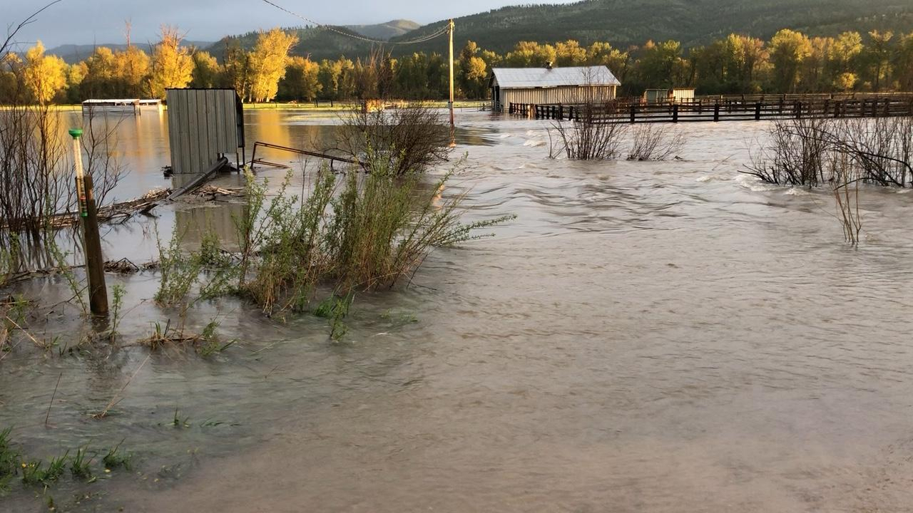

```{r setup, include=FALSE}
source("./R/setup.R")
```

## {-}

Welcome to the June 2018 Montana Drought & Climate newsletter. We hope that Montana farmers and ranchers find the information here useful. Please [send us your feedback](mailto:mtdrought@umontana.edu)!

Here's what you'll find in this newsletter:

[**Conditions**](./am-2018-review.html) --- Understanding current conditions aids in predicting future conditions. This section provides an overview of what happened over the previous season and allows producers to reflect how conditions compare to past years.

[**Seasonal Forecast**](./jja-2018-forecast.html) --- The seasonal forecast discusses predictions for temperature, precipitation, drought, and global air circulation patterns that impact growing conditions and water availability in Montana.

[**Mid-Century Outlook**](./am-2018-midcentury.html) --- What do Montanans need to do to prepare for the future? In this section we present projections of mid-century conditions across Montana. Comparing these projected conditions to current or past conditions gives an improved understanding of how to respond to a changing climate.

[**Reference**](./reference.html) --- A helpful glossary of terms found in this newsletter.

-----

### In Brief {-}

<div style="-webkit-columns: 2 300px;-moz-columns: 2 300px;columns: 2 300px;">
* Spring in Montana was cooler and wetter than normal which delayed the melting of our heavy winter snowpack.
* A longer snowmelt contributed to more recharge of soil moisture and widespread flooding across the state.
* Significant soil moisture reserves associated with snowmelt and above normal spring precipitation will reduce the likelihood of drought and fire in the early summer.
* La Niña conditions dissipated in late April.
* The summer outlook is for warmer than normal temperatures across the western and central portions of the state. The forecast is less certain for the remainder of the state.
* The summer outlook for precipitation is drier than normal across northwestern, southwestern, and north-central portions of the state. The forecast is less certain for the remainder of the state.
* If warmer and drier conditions are realized in western and central regions, there is potential for soils to dry out and drought to set in.
</div>

-----

### Contribute to the CoCoRaHS network {-}

The Community Collaborative Rain Hail & Snow Network (CoCoRaHS) is a volunteer program to enhance precipitation records across North America, and deliver those records via a simple to use database. People throughout Montana have been involved in CoCoRaHS data collection for over twenty years. The CoCoRaHS network data is frequently used by the land managers and climatologists for management, research, and monitoring applications. This map shows the locations of all active CoCoRaHS stations in the state, and their recorded net precipitation in April and May. To learn more, search the data, or get involved, visit [https://www.cocorahs.org/](https://www.cocorahs.org/).

```{r cocorahs, collapse=TRUE, results='hold', message=FALSE, warning=FALSE, cache=TRUE}

cocorahs <- httr::GET(url = "http://data.cocorahs.org/export/exportreports.aspx",
                           query = list(ReportType="Daily",
                                        dtf=1,
                                        Format="CSV",
                                        State="MT",
                                        ReportDateType="reportdate",
                                        StartDate = "4/1/2018",
                                        EndDate="5/31/2018",
                                        TimesInGMT="False")) %>%
  httr::content() %>%
  dplyr::group_by(StationNumber,
                  Latitude,
                  Longitude) %>%
  dplyr::mutate(TotalPrecipAmt = as.numeric(TotalPrecipAmt),
                TotalPrecipAmt = ifelse(is.na(TotalPrecipAmt),0,TotalPrecipAmt)) %>%
  dplyr::summarise(TotalPrecipAmt = sum(TotalPrecipAmt)) %>%
  dplyr::ungroup() %>%
    dplyr::filter(!is.na(Longitude),
                !is.na(Latitude)) %>%
  sf::st_as_sf(coords = c("Longitude","Latitude"),
               crs = 4326,
               remove = FALSE) %>%
  sf::st_transform(mt_state_plane)


(cocorahs %>%
      ggplot2::ggplot() +
      ggplot2::geom_sf(ggplot2::aes(color = TotalPrecipAmt),
                       size = 1.5) +
          ggplot2::scale_color_distiller(name = stringr::str_c(format(lubridate::as_date("2018-04-01"), '%B %d, %Y')," - \n",
                                   format(lubridate::as_date("2018-05-31"), '%B %d, %Y'),"\n",
                                   "Net precipitation (in.)"),
                           direction = 1,
                           limits = range(cocorahs$TotalPrecipAmt),
                           # breaks = breaks,
                           palette = "YlGn",
                           expand = FALSE,
                           guide = guide_colourbar(title.position = "bottom")) +
      mtd_plot()) %T>%
  save_mt_map("CoCoRaHS.pdf")

```

-----

### About **Montana Drought & Climate**<br>and the **Montana Climate Office** {-}
[Montana Drought and Climate](https://climate.umt.edu/mtdrought/) is a USDA-funded project of the [Montana Climate Office (MCO)](https://climate.umt.edu/) at the W.A. Franke College of Forestry & Conservation at the University of Montana, in collaboration with the Montana State University Extension Service. The MCO is an independent state-designated body that provides Montanans with high-quality, timely, relevant, and scientifically-based climate information and services. We strive to be a credible and expert source of information for decision makers that rely on the most current information on climate to make important decisions. It is also the role of the MCO to assist stakeholders in interpreting climate information or adapting climate products to their needs.

Production of this newsletter is supported by Water for Agriculture Challenge Area grant no. 2017-67027-26313 from the [USDA National Institute of Food and Agriculture](https://nifa.usda.gov/) and by the [Montana Water Center](http://www.montanawatercenter.org/). Any opinions, findings, conclusions, or recommendations expressed in this publication are those of the author(s) and do not necessarily reflect the view of the U.S. Department of Agriculture, the Montana Water Center, or the University of Montana. Please refer to the Montana Climate Office user agreement and disclaimer at [climate.umt.edu/disclaimer](http://climate.umt.edu/disclaimer/).

<br>
<div style="text-align: left;">
{style="width:400px;"}
</div>


-----

<br>
<a href="https://climate.umt.edu/" target="_blank">
  
</a>
[Montana Climate Office](https://climate.umt.edu/)<br>
Montana Forest & Conservation Experiment Station<br>
University of Montana<br>
32 Campus Drive<br>
Missoula, MT 59812<br>

P: (406) 243-6793<br>
E: [mtdrought@umontana.edu](mailto:mtdrought@umontana.edu)<br>
W: [http://climate.umt.edu/](http://climate.umt.edu/)
