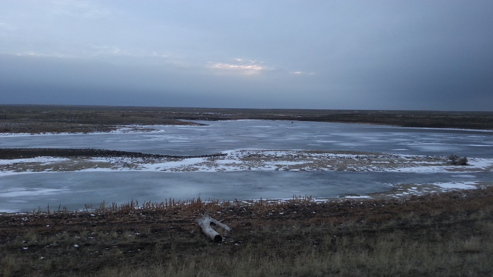

```{r setup, include=FALSE}
source("./R/setup.R")
```

<!--  -->

## {- .tabset .tabset-fade .tabset-pills}

###  El Niño/La Niña {-}

#### Temperature {-}
```{r future-seasonal-enso-temp, fig.retina = 2, fig.align = "center", out.width = '100%', collapse=TRUE, results='hold', message=FALSE, warning=FALSE, cache=TRUE}


enso_temp <- mtd_plot_enso(months = 6:8,
                                element = "tmpc",
                                agg_fun = mean)
 
enso_temp$map
```

#### Precipitation {-}
```{r future-seasonal-enso-prcp, collapse=TRUE, results='hold', message=FALSE, warning=FALSE, cache=TRUE}

enso_prcp <- mtd_plot_enso(months = 6:8,
                                element = "pcpn",
                                agg_fun = sum)
 
enso_prcp$map
```


###  Temperature {-}


```{r future-seasonal-temp, collapse=TRUE, results='hold', message=FALSE, warning=FALSE, cache=TRUE}

climdiv_tmpc <- climdiv_summary(months = 6:8,
                                year = 2017,
                                element = "tmpc",
                                agg_fun = mean)


noaa_seasonal <- mtd_plot_noaa_seasonal_forecast(date = "2018-06-01",
                                                 element = "temp",
                                                 data_out = "../data/NOAA_seasonal")

noaa_seasonal$map
```

###  Precipitation {-}

```{r future-seasonal-prcp, collapse=TRUE, results='hold', message=FALSE, warning=FALSE, cache=TRUE}

climdiv_pcpn <- climdiv_summary(months = 6:8,
                                year = 2017,
                                element = "pcpn",
                                agg_fun = sum)

noaa_seasonal <- mtd_plot_noaa_seasonal_forecast(date = "2018-06-01",
                                                 element = "prcp",
                                                 data_out = "../data/NOAA_seasonal")

noaa_seasonal$map

```

###  Drought {-}

```{r future-seasonal-drought, fig.retina = 2, fig.align = "center", out.width = '100%', collapse=TRUE, results='hold', message=FALSE, warning=FALSE, cache=TRUE}

future_seasonal_drought <- mtd_plot_noaa_drought_outlook(date = "2018-06-01",
                              data_out = "../data/NOAA_droughtlook")

future_seasonal_drought$map

```

