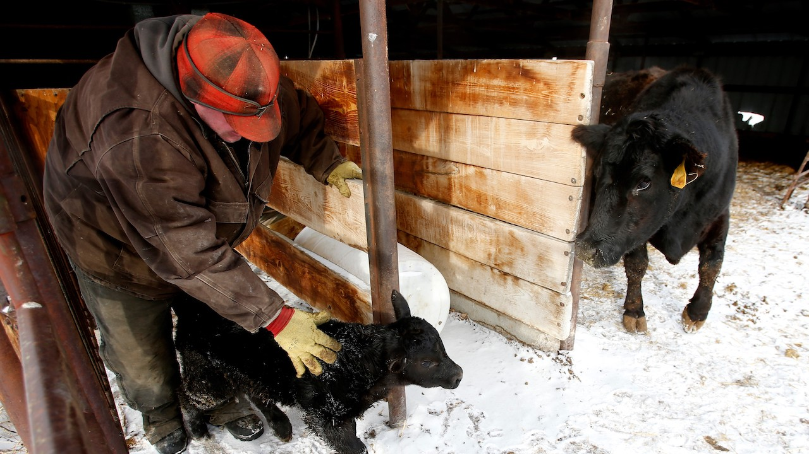

```{r setup, include=FALSE, cache=FALSE}
source("./R/setup.R")
```



## {- .tabset .tabset-fade .tabset-pills}

###  El Niño Update {-}

The El Niño Southern Oscillation (ENSO) is a natural seasonal fluctuation in the sea surface temperature of the Pacific ocean near the equator. El Niño events have a strong influence on winter weather across Montana, and less of an influence during the rest of the year. We are still experiencing a weak El Niño, but conditions through this winter have been very different (much colder!) than a typical El Niño. Historically, April--June precipitation and temperature during an El Niño year are practically identical to those of a normal or La Niña year, meaning that climate forecasting is more difficult and must depend on other data to make seasonal predictions.

These maps show what an average El Niño April--June looks like relative to normal. Keep an eye on the NOAA ENSO outlook ([https://www.climate.gov/enso](https://www.climate.gov/enso)) for the latest ENSO conditions and predictions as we head into late spring.

```{r load enso, cache=TRUE}
# enso <- mtd_get_all_enso_ee(start_date = "2019-04-01",
#                                 end_date = "2019-07-01") %T>%
#   readr::write_rds("../Data/gridmet/ENSO_AMJ.rds",
#                      compress = "gz")

enso <- readr::read_rds("../Data/gridmet/ENSO_AMJ.rds")

enso %<>%
  purrr::transpose()

enso$pr %<>%
  purrr::map(mm_to_in)

enso$tmmn %<>%
  purrr::map(k_to_f)

enso$tmmx %<>%
  purrr::map(k_to_f)

enso %<>%
  purrr::transpose() %>%
  purrr::map(function(x){
    x$tmean <- (x$tmmn + x$tmmx)/2
    return(x)
  })

enso_series <- mtd_get_enso_series_ee()

```

Early spring during an El Niño event is on average warmer than normal across Montana, especially as you move towards northwestern Montana.

```{r future-seasonal-enso, fig.retina = 2, fig.align = "center", out.width = '100%', collapse=TRUE, results='hold', message=FALSE, warning=FALSE, cache=TRUE}

enso$`El Niño` %>%
  mtd_plot_enso_grid(element = "tmean",
                     use_normal = TRUE,
                     Season = "Apr-Jun") %T>%
  save_mt_map("forecast_enso_tmean.pdf")

enso$`El Niño` %>%
  mtd_plot_enso_grid(element = "prcp",
                     use_normal = TRUE,
                     Season = "Apr-Jun") %T>%
  save_mt_map("forecast_enso_prcp.pdf")

```

The two graphs below show how Montana as a whole is affected by the ENSO climate patterns. The solid lines represent the average conditions in each of El Niño, La Niña, and ENSO Neutral conditions (see the [Reference](./reference.html) section for an explanation of these conditions). The dashed lines represent the range of recorded conditions during the 1981--2010 period on any given day.

For temperature, ENSO conditions only have a strong influence on Montana climate in the winter months; the solid green line (El Niño) is above the other lines during the winter, indicating warmer winter conditions on average in El Niño years.

For precipitation, however, it is very difficult to distinguish the three solid lines. El Niño conditions lead to slightly drier winters, while La Niña conditions are indistinguishable from ENSO Neutral conditions with regard to winter precipitation across Montana.

```{r future-seasonal-enso-prcp, collapse=TRUE, results='hold', message=FALSE, warning=FALSE, cache=FALSE}

enso_series %>%
  mtd_plot_climatology_enso(element = "tmean",
                            ybreaks = seq(-10, 80, 10))

ggplot2::ggsave("./figures/forecast_enso_graph_tmean.pdf")

enso_series %>%
  mtd_plot_climatology_enso(element = "prcp",
                            ybreaks = seq(0,0.8,0.1))

ggplot2::ggsave("./figures/forecast_enso_graph_prcp.pdf")


```


###  Temperature {-}
NOAA's Climate Prediction Center (CPC) is projecting that temperatures will likely be warmer than normal across western Montana this spring, and potentially cooler than normal across eastern Montana. Warmer temperatures may accelerate spring snowmelt and prompt an earlier start to the growing season.

```{r future-seasonal-temp, collapse=TRUE, results='hold', message=FALSE, warning=FALSE, cache=TRUE}

noaa_seasonal <- mtd_plot_noaa_seasonal_forecast(date = "2019-04-15",
                                                 element = "temp",
                                                 data_out = "../data/NOAA_seasonal")

noaa_seasonal$map %T>%
  save_mt_map("forecast_noaa_seasonal_temperature.pdf")
```

###  Precipitation {-}

The CPC has increased its seasonal precipitation forecast across southern Montana to "somewhat likely wetter" conditions. The rest of the state continues to be in the "Equal Chances" category, meaning that  precipitation may be higher, lower, or near normal depending upon particular storm tracks. The timing of these storms will matter too; precipitation in the spring may still fall as snow in the mountains, but as we move into late spring rain-dominant storms could accelerate snowmelt.

```{r future-seasonal-prcp, collapse=TRUE, results='hold', message=FALSE, warning=FALSE, cache=TRUE}

noaa_seasonal <- mtd_plot_noaa_seasonal_forecast(date = "2019-04-15",
                                                 element = "prcp",
                                                 data_out = "../data/NOAA_seasonal")

noaa_seasonal$map %T>%
  save_mt_map("forecast_noaa_seasonal_precipitation.pdf")

```

<!-- ###  Drought {-} -->
<!-- The three month drought outlook suggests that drought will persist through August in Daniels, Sheridan, and Roosevelt counties. Due to late may rainfall these counties were recently downgraded to “abnormally dry.” Drought development is not predicted for the remainder of the state; however, drought development may still be possible given the uncertain seasonal forecast (above) for eastern portions of the state and warmer and drier than normal forecast for western portions of the state. For example, portions of Valley, Phillips, and Blaine counties have been designated as abnormally dry due to lack of rainfall in the past month and drying soil conditions. -->

<!-- ```{r future-seasonal-drought, fig.retina = 2, fig.align = "center", out.width = '100%', collapse=TRUE, results='hold', message=FALSE, warning=FALSE, cache=TRUE} -->

<!-- future_seasonal_drought <- mtd_plot_noaa_drought_outlook(date = "2019-04-15", -->
<!--                               data_out = "../data/NOAA_droughtlook") -->

<!-- future_seasonal_drought$map -->

<!-- ``` -->

