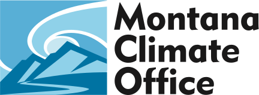

```{r setup, include=FALSE}
source("./R/setup.R")
```

---

## {-}
Here's what you'll find in the June 2020 Montana Drought & Climate newsletter:

[**Early Summer 2020 Update**](./review.html) --- Understanding current and past conditions aids in predicting future conditions. This section provides an overview of how this spring is progressing.

[**Summer Forecast**](./forecast.html) --- The seasonal forecast discusses predictions for temperature, precipitation, and drought, as well as the global air circulation patterns that impact growing conditions and water availability in Montana.

[**Reference**](./reference.html) --- A helpful glossary of terms found in this newsletter.

---

### In Brief:{-}

<div style="-webkit-columns: 2 300px;-moz-columns: 2 300px;columns: 2 300px;">
* Across Montana, cool weather this spring will likely give way to warmer than normal summer temperatures.

* Much of the state has experienced drier than normal conditions since April, which are likely to continue into the summer.

* Moderate drought conditions have been declared in southwestern Montana, and many parts of the state are abnormally dry as of early June. Expectdry conditions to persist and intensify if dry and warm seasonal forecasts play out as expected.

</div>

-----

### Get Up-to-date Drought Conditions in Montana {-}

As we move into the summer, the [Montana Climate Office](https://climate.umt.edu/) continues to monitor developing drought conditions across Montana, and to provide *you* with useful and timely online tools for agricultural decision making. Be sure to keep an eye on the [Upper Missouri River Basin (UMRB) drought indicators dashboard](https://drought.climate.umt.edu)---it is updated nightly, and provides access to drought metrics used regularly by the [Montana Governor’s Drought and Water Supply Advisory Committee](http://dnrc.mt.gov/divisions/water/drought-management/drought-committee/monitoring-sub-committee-msc). Check out the dashboard at https://drought.climate.umt.edu.

[ drought indicators dashboard")](https://drought.climate.umt.edu)

The dashboard is currently under development, and we continue to gather feedback from producers across the state. Please email Zach Hoylman at [state.climatologist@umontana.edu](mailto:state.climatologist@umontana.edu) with any feedback or questions.

-----


### We want to hear from you! {-}
**Please send us stories, photos, feedback, and questions!** Your story about how you use this information, photos of your farm or ranch, or your question could be featured in the next newsletter.

Please contact [mtdrought@umontana.edu](mailto:mtdrought@umontana.edu)<br> with questions and comments, or to be added to our mailing list.

-----

### About **Montana Drought & Climate**<br>and the **Montana Climate Office** {-}
[Montana Drought & Climate](https://climate.umt.edu/mtdrought/) is a USDA-funded project of the [Montana Climate Office (MCO)](https://climate.umt.edu/) at the W.A. Franke College of Forestry & Conservation at the University of Montana, in collaboration with the Montana State University Extension Service. The MCO is an independent state-designated body that provides Montanans with high-quality, timely, relevant, and scientifically-based climate information and services. We strive to be a credible and expert source of information for decision makers that rely on the most current information on climate to make important decisions. It is also the role of the MCO to assist stakeholders in interpreting climate information or adapting climate products to their needs.

Production of this newsletter is supported by Water for Agriculture Challenge Area grant no. 2017-67027-26313 from the [USDA National Institute of Food and Agriculture](https://nifa.usda.gov/) and by the [Montana Water Center](https://www.montanawatercenter.org/). Any opinions, findings, conclusions, or recommendations expressed in this publication are those of the author(s) and do not necessarily reflect the view of the U.S. Department of Agriculture, the Montana Water Center, or the University of Montana. Please refer to the Montana Climate Office user agreement and disclaimer at [climate.umt.edu/disclaimer](https://climate.umt.edu/disclaimer/).

<br>
<div style="text-align: left;">
{style="width:400px;"}
</div>

-----

<br>
<a href="https://climate.umt.edu/" target="_blank">
  
</a>
[Montana Climate Office](https://climate.umt.edu/)<br>
Montana Forest & Conservation Experiment Station<br>
University of Montana<br>
32 Campus Drive<br>
Missoula, MT 59812<br>

P: (406) 243-6793<br>
E: [mtdrought@umontana.edu](mailto:mtdrought@umontana.edu)<br>
W: [https://climate.umt.edu/](https://climate.umt.edu/)
