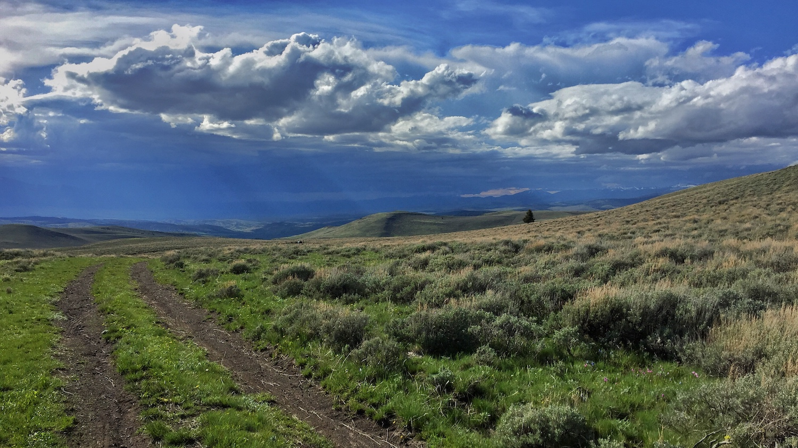

```{r setup, include=FALSE, cache=FALSE}
source("./R/setup.R")
```



## {- .tabset .tabset-fade .tabset-pills}

###  El Niño Update {-}

The El Niño Southern Oscillation (ENSO) is a natural seasonal fluctuation in the sea surface temperature of the Pacific Ocean near the equator. In July, the Pacific officially moved out of El Niño conditions, and is currently in ENSO Neutral conditions (neither El Niño nor La Niña). NOAA is forecasting that it will likely stay neutral through the spring and summer. In Montana, spring conditions vary greatly under ENSO Neutral. The two graphs below show how Montana as a whole is affected by the ENSO climate patterns. The solid lines represent the average conditions in each of El Niño, La Niña, and ENSO Neutral conditions (see the [Reference](./reference.html) section for an explanation of these conditions). The dashed lines represent the range of recorded conditions during the 1981--2010 period on any given day. Notice that the range for ENSO Neutral conditions (orange dashed lines) is wider than for El Niño or La Niña---ENSO Neutral conditions can be warmer or cooler, and wetter or dryer, than normal conditions.

<!-- These maps show what an average El Niño April--June looks like relative to normal. Keep an eye on the NOAA ENSO outlook ([https://www.climate.gov/enso](https://www.climate.gov/enso)) for the latest ENSO conditions and predictions as we head into late spring. -->

```{r load enso, cache=TRUE}
# enso <- mtd_get_all_enso_ee(start_date = "2020-04-01",
#                                 end_date = "2020-07-01") %T>%
#   readr::write_rds("../Data/gridmet/ENSO_AMJ.rds",
#                      compress = "gz")

enso <- readr::read_rds("../data/gridmet/ENSO_AMJ.rds")

enso %<>%
  purrr::transpose()

enso$pr %>%
  purrr::map(mm_to_in)

enso$tmmn %<>%
  purrr::map(k_to_f)

enso$tmmx %<>%
  purrr::map(k_to_f)

enso %<>%
  purrr::transpose() %>%
  purrr::map(function(x){
    x$tmean <- (x$tmmn + x$tmmx)/2
    return(x)
  })

enso_series <- mtd_get_enso_series_ee()

```

<!-- ```{r future-seasonal-enso, fig.retina = 2, fig.align = "center", out.width = '100%', collapse=TRUE, results='hold', message=FALSE, warning=FALSE, cache=TRUE} -->

<!-- enso$`ENSO Neutral` %>% -->
<!--   mtd_plot_enso_grid(element = "tmean", -->
<!--                      use_normal = TRUE, -->
<!--                      Season = "Nov-Jan", -->
<!--                      enso = "ENSO Neutral") %T>% -->
<!--   save_mt_map("forecast_enso_tmean.pdf") -->

<!-- enso$`ENSO Neutral` %>% -->
<!--   mtd_plot_enso_grid(element = "prcp", -->
<!--                      use_normal = TRUE, -->
<!--                      Season = "Nov-Jan", -->
<!--                      enso = "ENSO Neutral") %T>% -->
<!--   save_mt_map("forecast_enso_prcp.pdf") -->

<!-- ``` -->

```{r future-seasonal-enso-prcp, collapse=TRUE, results='hold', message=FALSE, warning=FALSE, cache=FALSE}

enso_series %>%
  mtd_plot_climatology_enso(date_range = c("2019-10-01","2020-09-30"),
                            element = "tmean",
                            ybreaks = seq(-10, 80, 10))

ggplot2::ggsave("./figures/forecast_enso_graph_tmean.pdf", width = 5.13, height = 2.49)

enso_series %>%
  mtd_plot_climatology_enso(date_range = c("2019-10-01","2020-09-30"),
                            element = "prcp",
                            ybreaks = seq(0,0.8,0.1))

ggplot2::ggsave("./figures/forecast_enso_graph_prcp.pdf", width = 5.13, height = 2.49)


```


###  Temperature {-}
During ENSO Neutral conditions, climate forecasters rely on other types of data to create seasonal outlooks (since neither El Niño nor La Niña is influencing the state). NOAA's Climate Prediction Center (CPC) is projecting that temperatures are somewhat likely to be warmer than normal across western Montana into early summer (April–June). This is a fairly weak prediction (due to ENSO Neutral conditions); there is still a chance that temperatures could be cooler than normal in western Montana. Most of the rest of the state has equal chances of being cooler or warmer than normal.

```{r future-seasonal-temp, collapse=TRUE, results='hold', message=FALSE, warning=FALSE, cache=TRUE}

noaa_seasonal <- mtd_plot_noaa_seasonal_forecast(date = "2020-04-15",
                                                 element = "temp",
                                                 data_out = "../data/NOAA_seasonal")

noaa_seasonal$map %T>%
  save_mt_map("forecast_noaa_seasonal_temperature.pdf")
```

###  Precipitation {-}

NOAA's Climate Prediction Center (CPC) is forecasting that April–June precipitation near the eastern edge Montana is somewhat likely to be wetter than normal, with the rest of the state having equal chances of being wetter or drier than normal. Keep in mind that while the CPC is projecting somewhat wetter conditions in eastern Montana, this map doesn't reflect *how much* wetter is it likely to be, or the intensity of specific precipitation events.

```{r future-seasonal-prcp, collapse=TRUE, results='hold', message=FALSE, warning=FALSE, cache=TRUE}

noaa_seasonal <- mtd_plot_noaa_seasonal_forecast(date = "2020-04-15",
                                                 element = "prcp",
                                                 data_out = "../data/NOAA_seasonal")

noaa_seasonal$map %T>%
  save_mt_map("forecast_noaa_seasonal_precipitation.pdf")

```

<!-- ###  Drought {-} -->
<!-- The three month drought outlook suggests that drought will persist through August in Daniels, Sheridan, and Roosevelt counties. Due to late may rainfall these counties were recently downgraded to “abnormally dry.” Drought development is not predicted for the remainder of the state; however, drought development may still be possible given the uncertain seasonal forecast (above) for eastern portions of the state and warmer and drier than normal forecast for western portions of the state. For example, portions of Valley, Phillips, and Blaine counties have been designated as abnormally dry due to lack of rainfall in the past month and drying soil conditions. -->

<!-- ```{r future-seasonal-drought, fig.retina = 2, fig.align = "center", out.width = '100%', collapse=TRUE, results='hold', message=FALSE, warning=FALSE, cache=TRUE} -->

<!-- future_seasonal_drought <-  -->
<!--   mtd_plot_noaa_drought_outlook(date = "2020-04-15", -->
<!--                                 data_out = "../data/NOAA_droughtlook") -->

<!-- future_seasonal_drought$map -->

<!-- ``` -->

###  Hydrologic Outlook {-}
Spring streamflow in western Montana is likely to be near normal given the slightly above normal snowpack across the region. This could change if the seasonal outlook of warmer than normal temperatures for the western region comes to pass, causing rapid loss of snowpack and swelling of rivers. NOAA's Missouri River Basin River Forecast Center is predicting near normal stream flows for most of the central to eastern portions of state, with the exception of moderate flooding in north central Montana around Battle Creek, Clear Creek, Lodge Creek and the Milk River. Early snowmelt on the plains has already contributed to flooding on the Milk River. Visit https://water.weather.gov for up-to-date stream gauge and flood forecasting across Montana.
