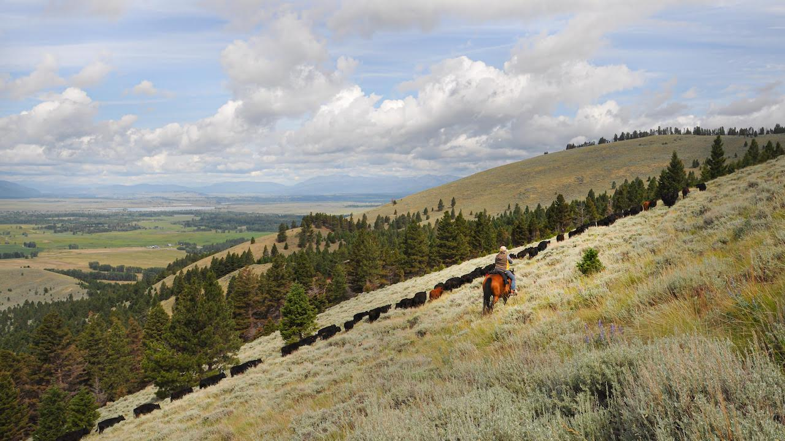

```{r setup, include=FALSE, cache=FALSE}
source("./R/setup.R")
```



## {- .tabset .tabset-fade .tabset-pills}

###  El Niño Update {-}

The El Niño Southern Oscillation (ENSO) is a natural seasonal fluctuation in the sea surface temperature of the Pacific ocean near the equator. In July, the Pacific officially moved out of El Niño conditions, and is currently in ENSO Neutral conditions---NOAA is forecasting that it will likely stay neutral through this coming winter. In Montana, ENSO Neutral conditions during the winter vary greatly, and climate forecasters rely on other data to create the seasonal outlooks. You can see that in the two graphs below, which show how Montana as a whole is affected by the ENSO climate patterns. The solid lines represent the average conditions in each of El Niño, La Niña, and ENSO Neutral conditions (see the [Reference](./reference.html) section for an explanation of these conditions). The dashed lines represent the range of recorded conditions during the 1981--2010 period on any given day. Notice that the range for ENSO Neutral conditions (orange dashed lines) is wider than for El Niño or La Niña---ENSO Neutral conditions can be warmer or cooler, and wetter or dryer, than normal conditions.

<!-- These maps show what an average El Niño April--June looks like relative to normal. Keep an eye on the NOAA ENSO outlook ([https://www.climate.gov/enso](https://www.climate.gov/enso)) for the latest ENSO conditions and predictions as we head into late spring. -->

```{r load enso, cache=TRUE}
# enso <- mtd_get_all_enso_ee(start_date = "2019-12-01",
#                                 end_date = "2020-02-31") %T>%
#   readr::write_rds("../data/gridmet/ENSO_DJF.rds",
#                      compress = "gz")

enso <- readr::read_rds("../data/gridmet/ENSO_DJF.rds")

enso %<>%
  purrr::transpose()

enso$pr %>%
  purrr::map(mm_to_in)

enso$tmmn %<>%
  purrr::map(k_to_f)

enso$tmmx %<>%
  purrr::map(k_to_f)

enso %<>%
  purrr::transpose() %>%
  purrr::map(function(x){
    x$tmean <- (x$tmmn + x$tmmx)/2
    return(x)
  })

enso_series <- mtd_get_enso_series_ee()

```

<!-- ```{r future-seasonal-enso, fig.retina = 2, fig.align = "center", out.width = '100%', collapse=TRUE, results='hold', message=FALSE, warning=FALSE, cache=TRUE} -->

<!-- enso$`ENSO Neutral` %>% -->
<!--   mtd_plot_enso_grid(element = "tmean", -->
<!--                      use_normal = TRUE, -->
<!--                      Season = "Nov-Jan", -->
<!--                      enso = "ENSO Neutral") %T>% -->
<!--   save_mt_map("forecast_enso_tmean.pdf") -->

<!-- enso$`ENSO Neutral` %>% -->
<!--   mtd_plot_enso_grid(element = "prcp", -->
<!--                      use_normal = TRUE, -->
<!--                      Season = "Nov-Jan", -->
<!--                      enso = "ENSO Neutral") %T>% -->
<!--   save_mt_map("forecast_enso_prcp.pdf") -->

<!-- ``` -->

```{r future-seasonal-enso-prcp, collapse=TRUE, results='hold', message=FALSE, warning=FALSE, cache=FALSE}

enso_series %>%
  mtd_plot_climatology_enso(element = "tmean",
                            ybreaks = seq(-10, 80, 10))

ggplot2::ggsave("./figures/forecast_enso_graph_tmean.pdf")

enso_series %>%
  mtd_plot_climatology_enso(element = "prcp",
                            ybreaks = seq(0,0.8,0.1))

ggplot2::ggsave("./figures/forecast_enso_graph_prcp.pdf")


```


###  Temperature {-}
Based on climatological data other than the ENSO status, NOAA's Climate Prediction Center (CPC) is projecting that temperatures are somewhat likely to be warmer than normal across much of Montana this winter (December -- February). This is a fairly weak prediction, however; there is still a chance that temperatures could be cooler than normal in some areas.

```{r future-seasonal-temp, collapse=TRUE, results='hold', message=FALSE, warning=FALSE, cache=TRUE}

noaa_seasonal <- mtd_plot_noaa_seasonal_forecast(date = "2019-12-01",
                                                 element = "temp",
                                                 data_out = "../data/NOAA_seasonal")

noaa_seasonal$map %T>%
  save_mt_map("forecast_noaa_seasonal_temperature.pdf")
```

###  Precipitation {-}

The CPC is predicting that seasonal precipitation across Montana east of the Continental Divide is likely to be wetter this winter. Keep in mind that while the CPC is projecting wetter conditions, this map doesn't reflect *how much* wetter is it likely to be, or the intensity of precipitation events. Should the precipitation fall as rain, or snow followed by a melting event, flooding is a possibility given the current high soil moisture across the region.

```{r future-seasonal-prcp, collapse=TRUE, results='hold', message=FALSE, warning=FALSE, cache=TRUE}

noaa_seasonal <- mtd_plot_noaa_seasonal_forecast(date = "2019-12-01",
                                                 element = "prcp",
                                                 data_out = "../data/NOAA_seasonal")

noaa_seasonal$map %T>%
  save_mt_map("forecast_noaa_seasonal_precipitation.pdf")

```

<!-- ###  Drought {-} -->
<!-- The three month drought outlook suggests that drought will persist through August in Daniels, Sheridan, and Roosevelt counties. Due to late may rainfall these counties were recently downgraded to “abnormally dry.” Drought development is not predicted for the remainder of the state; however, drought development may still be possible given the uncertain seasonal forecast (above) for eastern portions of the state and warmer and drier than normal forecast for western portions of the state. For example, portions of Valley, Phillips, and Blaine counties have been designated as abnormally dry due to lack of rainfall in the past month and drying soil conditions. -->

<!-- ```{r future-seasonal-drought, fig.retina = 2, fig.align = "center", out.width = '100%', collapse=TRUE, results='hold', message=FALSE, warning=FALSE, cache=TRUE} -->

<!-- future_seasonal_drought <- mtd_plot_noaa_drought_outlook(date = "2019-06-01", -->
<!--                                                          data_out = "../data/NOAA_droughtlook") -->

<!-- future_seasonal_drought$map -->

<!-- ``` -->

