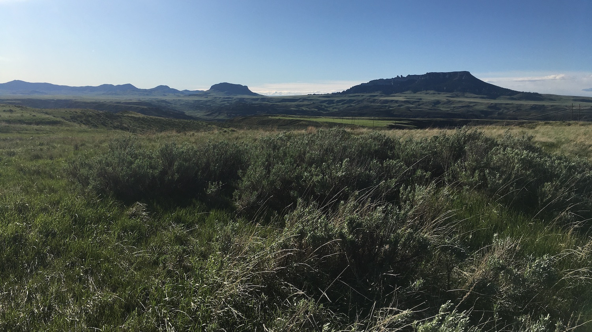

```{r setup, include=FALSE, cache=FALSE}
source("./R/setup.R")
```



## {- .tabset .tabset-fade .tabset-pills}

###  El Niño Update {-}

The El Niño Southern Oscillation (ENSO) is a natural seasonal fluctuation in the sea surface temperature of the Pacific Ocean near the equator. "El Niño" conditions exist when the sea surface temperatures are warmer than normal, and "La Niña" conditions exist when they are cooler than normal; "ENSO Neutral" conditions occur when sea surface temperatures are near normal. ENSO impacts on Montana's weather vary from moderate impacts during El Niño and ENSO Neutral conditions, to consistently large impacts during La Niña. In early October, NOAA advised that we are currently experiencing a moderate La Niña event that is expected to continue through the 2020/2021 winter (~85% chance) and may persist into spring 2021 (~60% chance during February--April). La Niña conditions may strengthen or weaken as we continue into winter. In Montana, La Niña conditions during the winter typically bring cooler than normal temperatures and wetter than normal precipitation conditions.

You can see that in the two graphs below, which show how Montana as a whole is affected by the ENSO climate patterns. The solid lines represent the average conditions in each of El Niño, La Niña, and ENSO Neutral conditions (see the [Reference](./reference.html) section for an explanation of these conditions). The dashed lines represent the range of recorded conditions during the 1981--2010 period on any given day. Notice that the range for ENSO Neutral conditions (orange dashed lines) is wider than for El Niño or La Niña---ENSO Neutral conditions can be warmer or cooler, and wetter or dryer, than normal conditions.

<!-- These maps show what an average El Niño April--June looks like relative to normal. Keep an eye on the NOAA ENSO outlook ([https://www.climate.gov/enso](https://www.climate.gov/enso)) for the latest ENSO conditions and predictions as we head into late spring. -->

```{r load enso, cache=TRUE}
# enso <- mtd_get_all_enso_ee(start_date = "2019-12-01",
#                                 end_date = "2020-02-31") %T>%
#   readr::write_rds("../data/gridmet/ENSO_DJF.rds",
#                      compress = "gz")

enso <- readr::read_rds("../data/gridmet/ENSO_DJF.rds")

enso %<>%
  purrr::transpose()

enso$pr %>%
  purrr::map(mm_to_in)

enso$tmmn %<>%
  purrr::map(k_to_f)

enso$tmmx %<>%
  purrr::map(k_to_f)

enso %<>%
  purrr::transpose() %>%
  purrr::map(function(x){
    x$tmean <- (x$tmmn + x$tmmx)/2
    return(x)
  })

enso_series <- mtd_get_enso_series_ee()

```

<!-- ```{r future-seasonal-enso, fig.retina = 2, fig.align = "center", out.width = '100%', collapse=TRUE, results='hold', message=FALSE, warning=FALSE, cache=TRUE} -->

<!-- enso$`ENSO Neutral` %>% -->
<!--   mtd_plot_enso_grid(element = "tmean", -->
<!--                      use_normal = TRUE, -->
<!--                      Season = "Nov-Jan", -->
<!--                      enso = "ENSO Neutral") %T>% -->
<!--   save_mt_map("forecast_enso_tmean.pdf") -->

<!-- enso$`ENSO Neutral` %>% -->
<!--   mtd_plot_enso_grid(element = "prcp", -->
<!--                      use_normal = TRUE, -->
<!--                      Season = "Nov-Jan", -->
<!--                      enso = "ENSO Neutral") %T>% -->
<!--   save_mt_map("forecast_enso_prcp.pdf") -->

<!-- ``` -->

```{r future-seasonal-enso-prcp, collapse=TRUE, results='hold', message=FALSE, warning=FALSE, cache=FALSE}

enso_series %>%
  mtd_plot_climatology_enso(date_range = c("2019-10-01","2020-09-30"),
                            element = "tmean",
                            ybreaks = seq(-10, 80, 10))

ggplot2::ggsave("./figures/forecast_enso_graph_tmean.pdf", width = 5.13, height = 2.49)

enso_series %>%
  mtd_plot_climatology_enso(date_range = c("2019-10-01","2020-09-30"),
                            element = "prcp",
                            ybreaks = seq(0,0.8,0.1))

ggplot2::ggsave("./figures/forecast_enso_graph_prcp.pdf", width = 5.13, height = 2.49)


```

###  Temperature {-}
NOAA's Climate Prediction Center (CPC) is projecting cooler than normal conditions throughout the winter (December--February), especially in the northeastern part of the state.

```{r future-seasonal-temp, collapse=TRUE, results='hold', message=FALSE, warning=FALSE, cache=TRUE}

noaa_seasonal <- mtd_plot_noaa_seasonal_forecast(date = "2020-12-01",
                                                 element = "temp",
                                                 data_out = "../data/NOAA_seasonal")

noaa_seasonal$map %T>%
  save_mt_map("forecast_noaa_seasonal_temperature.pdf")
```

###  Precipitation {-}

NOAA's Climate Prediction Center (CPC) is forecasting that December--February precipitation will be higher than normal across all of Montana, with more confidence in wetter conditions for northern Montana. Wetter conditions should help reduce drought conditions across much of the state the winter months, and can be expected to provide heavy snowpack in the high country.

```{r future-seasonal-prcp, collapse=TRUE, results='hold', message=FALSE, warning=FALSE, cache=TRUE}

noaa_seasonal <- mtd_plot_noaa_seasonal_forecast(date = "2020-12-01",
                                                 element = "prcp",
                                                 data_out = "../data/NOAA_seasonal")

noaa_seasonal$map %T>%
  save_mt_map("forecast_noaa_seasonal_precipitation.pdf")

```

