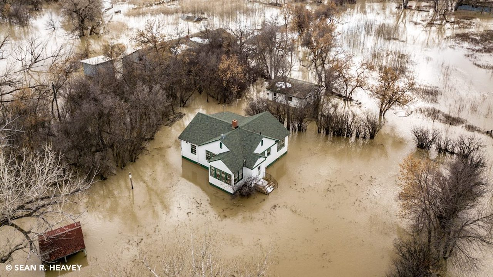

```{r setup, include=FALSE}
source("./R/setup.R")
```

## {-}

Welcome to the June 2019 Montana Drought & Climate newsletter. We hope that Montana farmers and ranchers find the information here useful. Please [send us your feedback](mailto:mtdrought@umontana.edu)!

Here's what you'll find in this newsletter:

[**Late Spring 2019 Update**](./review.html) --- Understanding current and past conditions aids in predicting future conditions. This section provides an overview of how this spring is progressing.

[**Summer 2019 Forecast**](./forecast.html) --- The seasonal forecast discusses predictions for temperature, precipitation, and drought, as well as the global air circulation patterns that impact growing conditions and water availability in Montana.

[**Reference**](./reference.html) --- A helpful glossary of terms found in this newsletter.

-----

### In Brief {-}

<div style="-webkit-columns: 2 300px;-moz-columns: 2 300px;columns: 2 300px;">
* April and May saw the return of generally normal temperatures across Montana. A series of cold storms has been punctuated by warm spring weather across most of the state. This has accelerated snowmelt in the high country and has led to flood conditions in western and central Montana.
* Soil moisture is high across Montana, though drying is occuring in the southwestern and eastern parts of the state.
* Abnormally dry conditions (the level just below drought conditions) exist in northwestern Montana. Evapotranspiration is also lower than normal in northwestern Montana, suggesting plant communities there are already experiencing the effects of dry conditions.
* The NOAA seasonal forecast for June--August is for warmer than normal conditions in western Montana and equal chances of warmer or cocoler conditions for the rest of the state. Summer is likely going to be wetter across much of Montana.
</div>

-----

### Mark your calendars!<br>MT Drought & Climate newsletter timing {-}
We traveled the state in summer 2018, meeting with farmers and ranchers in St. Ignatius, Chester, Harlowton, Fairfield, and Choteau. We wanted to learn more about your operations, what kind of climate information would be helpful to you, and when you would like to see it. **Based on your feedback, we will provide this newsletter on March 1^st^, April 15^th^, June 1^st^, and October 15^th^.**

-----

### About **Montana Drought & Climate**<br>and the **Montana Climate Office** {-}
[Montana Drought & Climate](https://climate.umt.edu/mtdrought/) is a USDA-funded project of the [Montana Climate Office (MCO)](https://climate.umt.edu/) at the W.A. Franke College of Forestry & Conservation at the University of Montana, in collaboration with the Montana State University Extension Service. The MCO is an independent state-designated body that provides Montanans with high-quality, timely, relevant, and scientifically-based climate information and services. We strive to be a credible and expert source of information for decision makers that rely on the most current information on climate to make important decisions. It is also the role of the MCO to assist stakeholders in interpreting climate information or adapting climate products to their needs.

Production of this newsletter is supported by Water for Agriculture Challenge Area grant no. 2017-67027-26313 from the [USDA National Institute of Food and Agriculture](https://nifa.usda.gov/) and by the [Montana Water Center](https://www.montanawatercenter.org/). Any opinions, findings, conclusions, or recommendations expressed in this publication are those of the author(s) and do not necessarily reflect the view of the U.S. Department of Agriculture, the Montana Water Center, or the University of Montana. Please refer to the Montana Climate Office user agreement and disclaimer at [climate.umt.edu/disclaimer](https://climate.umt.edu/disclaimer/).

<br>
<div style="text-align: left;">
{style="width:400px;"}
</div>

-----

<br>
<a href="https://climate.umt.edu/" target="_blank">
  
</a>
[Montana Climate Office](https://climate.umt.edu/)<br>
Montana Forest & Conservation Experiment Station<br>
University of Montana<br>
32 Campus Drive<br>
Missoula, MT 59812<br>

P: (406) 243-6793<br>
E: [mtdrought@umontana.edu](mailto:mtdrought@umontana.edu)<br>
W: [https://climate.umt.edu/](https://climate.umt.edu/)
