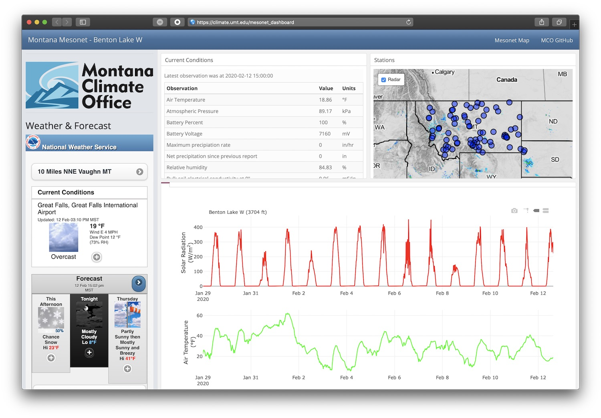

```{r setup, include=FALSE}
source("./R/setup.R")
```

## {-}

Happy New Year! Welcome to the March 2020 Montana Drought & Climate newsletter. We hope that Montana farmers and ranchers find the information here useful. Please [send us your feedback](mailto:mtdrought@umontana.edu)!

Here's what you'll find in this newsletter:

[**Winter 2019/2020 Update**](./review.html) --- Understanding current and past conditions aids in predicting future conditions. This section provides an overview of how this spring is progressing.

[**Spring Forecast**](./forecast.html) --- The seasonal forecast discusses predictions for temperature, precipitation, and drought, as well as the global air circulation patterns that impact growing conditions and water availability in Montana.

[**Reference**](./reference.html) --- A helpful glossary of terms found in this newsletter.

-----

### In Brief {-}

<div style="-webkit-columns: 2 300px;-moz-columns: 2 300px;columns: 2 300px;">
* Despite an early start, winter across Montana has been warmer and drier than average.
* Despite the temperature and precipitation amounts — and thanks to some sizeable storms in early February — snowpack in the mountains is above average.
* The NOAA seasonal forecast for March through May is for slightly warmer than normal conditions across western Montana, and likely wetter conditions than normal in eastern Montana. Warmer temperatures in western MT tilt the odds towards earlier snowmelt and an earlier start to the growing season.
</div>

-----

### Enhanced agricultural weather monitoring from the Montana Mesonet {-}

The [Montana Climate Office](https://climate.umt.edu/) is always looking for ways to serve Montanan's better, and we've recently developed a new resource for getting weather information in your local area. The [Montana Mesonet Dashboard](https://climate.umt.edu/mesonet_dashboard) delivers up to date weather information at [Montana Mesonet](https://climate.umt.edu/mesonet/) stations across the state. This dashboard provides the latest data for each MT Mesonet station, and tables and graphs of data going back two weeks. Check out the dashboard at [https://climate.umt.edu/mesonet_dashboard]. 

[](https://climate.umt.edu/mesonet_dashboard)

The dashboard is currently under development, and we definitely want your feedback. Please email Zach Hoylman at [state.climatologist@umontana.edu](mailto:state.climatologist@umontana.edu) with any feedback or questions.

-----


### We want to hear from you! {-}
**Please send us stories, photos, feedback, and questions!** Your story about how you use this information, photos of your farm or ranch, or your question could be featured in the next newsletter.

Please contact [mtdrought@umontana.edu](mailto:mtdrought@umontana.edu)<br> with questions and comments, or to be added to our mailing list.

-----

### About **Montana Drought & Climate**<br>and the **Montana Climate Office** {-}
[Montana Drought & Climate](https://climate.umt.edu/mtdrought/) is a USDA-funded project of the [Montana Climate Office (MCO)](https://climate.umt.edu/) at the W.A. Franke College of Forestry & Conservation at the University of Montana, in collaboration with the Montana State University Extension Service. The MCO is an independent state-designated body that provides Montanans with high-quality, timely, relevant, and scientifically-based climate information and services. We strive to be a credible and expert source of information for decision makers that rely on the most current information on climate to make important decisions. It is also the role of the MCO to assist stakeholders in interpreting climate information or adapting climate products to their needs.

Production of this newsletter is supported by Water for Agriculture Challenge Area grant no. 2017-67027-26313 from the [USDA National Institute of Food and Agriculture](https://nifa.usda.gov/) and by the [Montana Water Center](https://www.montanawatercenter.org/). Any opinions, findings, conclusions, or recommendations expressed in this publication are those of the author(s) and do not necessarily reflect the view of the U.S. Department of Agriculture, the Montana Water Center, or the University of Montana. Please refer to the Montana Climate Office user agreement and disclaimer at [climate.umt.edu/disclaimer](https://climate.umt.edu/disclaimer/).

<br>
<div style="text-align: left;">
{style="width:400px;"}
</div>

-----

<br>
<a href="https://climate.umt.edu/" target="_blank">
  
</a>
[Montana Climate Office](https://climate.umt.edu/)<br>
Montana Forest & Conservation Experiment Station<br>
University of Montana<br>
32 Campus Drive<br>
Missoula, MT 59812<br>

P: (406) 243-6793<br>
E: [mtdrought@umontana.edu](mailto:mtdrought@umontana.edu)<br>
W: [https://climate.umt.edu/](https://climate.umt.edu/)
