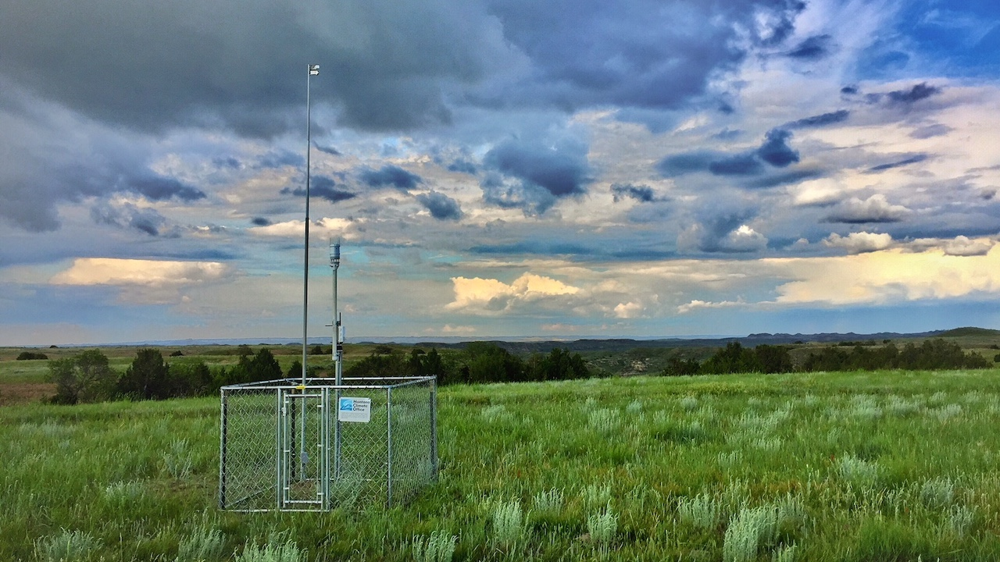

```{r setup, include=FALSE}
source("./R/setup.R")
```

## {-}

Welcome to the October 2018 Montana Drought & Climate newsletter. We hope that Montana farmers and ranchers find the information here useful. Please [send us your feedback](mailto:mtdrought@umontana.edu)!

Here's what you'll find in this newsletter:

[**Growing Season 2018**](./review.html) --- Understanding current conditions aids in predicting future conditions. This section provides an overview of what happened this past summer.

[**Winter 2018--2019**](./forecast.html) --- The seasonal forecast discusses predictions for temperature, precipitation, drought, and global air circulation patterns that impact growing conditions and water availability in Montana.

[**Reference**](./reference.html) --- A helpful glossary of terms found in this newsletter.

-----

### In Brief {-}

<div style="-webkit-columns: 2 300px;-moz-columns: 2 300px;columns: 2 300px;">
* This past summer was drier than normal in north and northwest Montana, while the south and east of the state had much more precipitation than normal.
* Soil moisture in much of the state remained high throughout the summer.
* Drought declarations in Montana were mainly in response to atmospheric weather, as opposed to hydrologic or agricultural conditions on the ground. However, moderate hydrological drought has begun in basins of Northwestern Montana due to below normal precipitation and above average temperatures throughout the summer.
* There is a high probability of El Niño conditions arriving this winter, which historically leads to slightly drier and warmer conditions across central Montana.
* NOAA is predicting warmer and drier conditions statewide this winter. Keep this in mind when planning for next spring’s planting conditions.
</div>

-----

### Contribute to the CoCoRaHS network {-}

The Community Collaborative Rain Hail & Snow Network (CoCoRaHS) is a volunteer program to enhance precipitation records across North America, and deliver those records via a simple to use database. People throughout Montana have been involved in CoCoRaHS data collection for over twenty years. The CoCoRaHS network data is frequently used by the land managers and climatologists for management, research, and monitoring applications. This map shows the locations of all active CoCoRaHS stations in the state, and their recorded net precipitation in April and May. To learn more, search the data, or get involved, visit [https://www.cocorahs.org/](https://www.cocorahs.org/).

```{r cocorahs, collapse=TRUE, results='hold', message=FALSE, warning=FALSE, cache=FALSE}

start_date = "6/1/2018"
end_date = "8/31/2018"

cocorahs <- httr::GET(url = "http://data.cocorahs.org/export/exportreports.aspx",
                           query = list(ReportType="Daily",
                                        dtf=1,
                                        Format="CSV",
                                        State="MT",
                                        ReportDateType="reportdate",
                                        StartDate = start_date,
                                        EndDate = end_date,
                                        TimesInGMT="False")) %>%
  httr::content() %>%
  dplyr::group_by(StationNumber,
                  Latitude,
                  Longitude) %>%
  dplyr::mutate(TotalPrecipAmt = as.numeric(TotalPrecipAmt),
                TotalPrecipAmt = ifelse(is.na(TotalPrecipAmt),0,TotalPrecipAmt)) %>%
  dplyr::summarise(TotalPrecipAmt = sum(TotalPrecipAmt)) %>%
  dplyr::ungroup() %>%
    dplyr::filter(!is.na(Longitude),
                !is.na(Latitude)) %>%
  sf::st_as_sf(coords = c("Longitude","Latitude"),
               crs = 4326,
               remove = FALSE) %>%
  sf::st_transform(mt_state_plane)


(cocorahs %>%
      ggplot2::ggplot() +
      ggplot2::geom_sf(ggplot2::aes(color = TotalPrecipAmt),
                       size = 1.5) +
          ggplot2::scale_color_distiller(name = stringr::str_c(format(lubridate::as_date(start_date, 
                                                                                         tz = "America/Denver",
                                                                                         format = "%m/%d/%Y"), '%B %d, %Y')," - \n",
                                   format(lubridate::as_date(lubridate::as_date(end_date, 
                                                                                         tz = "America/Denver",
                                                                                         format = "%m/%d/%Y")), '%B %d, %Y'),"\n",
                                   "Net precipitation (in.)"),
                           direction = 1,
                           limits = range(cocorahs$TotalPrecipAmt),
                           # breaks = breaks,
                           palette = "YlGn",
                           expand = FALSE,
                           guide = guide_colourbar(title.position = "bottom")) +
      mtd_plot()) %T>%
  save_mt_map("CoCoRaHS.pdf")

```

-----

### About **Montana Drought & Climate**<br>and the **Montana Climate Office** {-}
[Montana Drought and Climate](https://climate.umt.edu/mtdrought/) is a USDA-funded project of the [Montana Climate Office (MCO)](https://climate.umt.edu/) at the W.A. Franke College of Forestry & Conservation at the University of Montana, in collaboration with the Montana State University Extension Service. The MCO is an independent state-designated body that provides Montanans with high-quality, timely, relevant, and scientifically-based climate information and services. We strive to be a credible and expert source of information for decision makers that rely on the most current information on climate to make important decisions. It is also the role of the MCO to assist stakeholders in interpreting climate information or adapting climate products to their needs.

Production of this newsletter is supported by Water for Agriculture Challenge Area grant no. 2017-67027-26313 from the [USDA National Institute of Food and Agriculture](https://nifa.usda.gov/) and by the [Montana Water Center](http://www.montanawatercenter.org/). Any opinions, findings, conclusions, or recommendations expressed in this publication are those of the author(s) and do not necessarily reflect the view of the U.S. Department of Agriculture, the Montana Water Center, or the University of Montana. Please refer to the Montana Climate Office user agreement and disclaimer at [climate.umt.edu/disclaimer](http://climate.umt.edu/disclaimer/).

<br>
<div style="text-align: left;">
{style="width:400px;"}
</div>


-----

<br>
<a href="https://climate.umt.edu/" target="_blank">
  
</a>
[Montana Climate Office](https://climate.umt.edu/)<br>
Montana Forest & Conservation Experiment Station<br>
University of Montana<br>
32 Campus Drive<br>
Missoula, MT 59812<br>

P: (406) 243-6793<br>
E: [mtdrought@umontana.edu](mailto:mtdrought@umontana.edu)<br>
W: [http://climate.umt.edu/](http://climate.umt.edu/)
