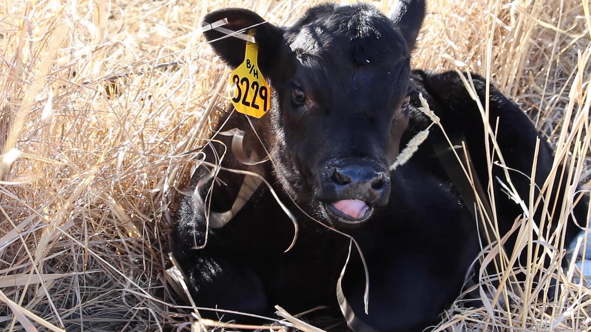
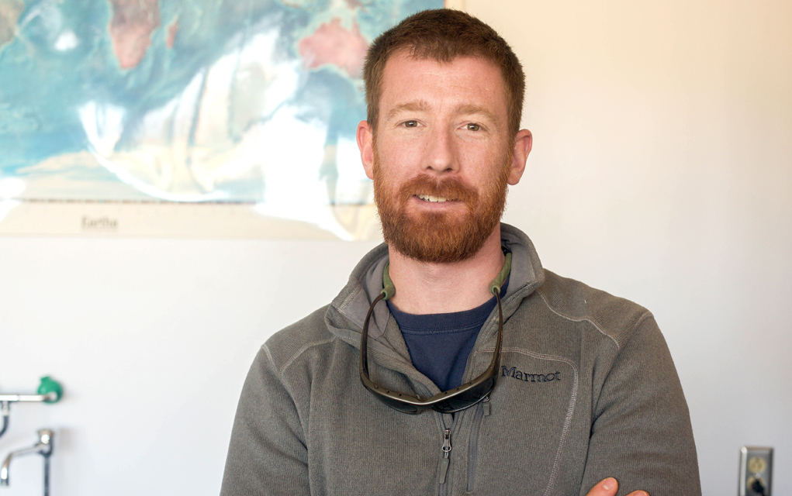
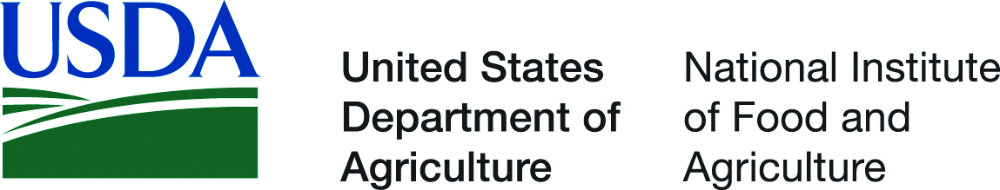
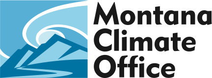

```{r setup, include=FALSE}
source("./R/setup.R")
```

---

### A Message from Montana State Climatologist Dr. Kelsey Jencso {-}

:::::: {.columns}
::: {.column width="40%"}

:::
::: {.column width="2%"}
\ 
<!-- an empty Div (with a whitespace), serving as
a column separator -->
:::
::: {.column width="58%"}
As communities across Montana continue to deal with COVID-19, I write to provide an update on the additional steps we are taking at the Montana Climate Office to prevent further spread of the virus and to protect the health and safety of our community. The Montana Climate Office has temporarily closed its doors on the University of Montana Campus and our employees are working from home to help minimize the spread here in Montana. Our operations will continue on a modified work schedule. Importantly, our climate data services and drought outlooks will continue on schedule. You can still contact us through email for climate and drought related questions. We are humbled by the hard work of the agricultural community, its creativity in finding solutions and true grit during this challenging time. Said simply, thank you for your efforts to produce our food and sustain Montana’s economy. We are here to help in any way that we can.
:::
::::::

-----

## {-}
Here's what you'll find in the April 2020 Montana Drought & Climate newsletter:

[**Spring 2020 Update**](./review.html) --- Understanding current and past conditions aids in predicting future conditions. This section provides an overview of how this spring is progressing.

[**Spring/Summer Forecast**](./forecast.html) --- The seasonal forecast discusses predictions for temperature, precipitation, and drought, as well as the global air circulation patterns that impact growing conditions and water availability in Montana.

[**Reference**](./reference.html) --- A helpful glossary of terms found in this newsletter.

---

### In Brief:{-}

Things are looking fairly normal, at least as far as climate is concerned...

<div style="-webkit-columns: 2 300px;-moz-columns: 2 300px;columns: 2 300px;">
* March and April have thus far been cooler than normal across most of Montana

* March and April have been much drier then normal in western and eatern Montana, and wetter than normal in central Montana.

* Mountain snowpack is currently normal to above normal across much of Montana.

* The NOAA seasonal forecast for April through June is for slightly warmer than normal conditions in western Montana, and slightly wetter than normal conditions in far eastern Montana. Most of the state is forecast to be near normal conditions.

* The hydrologic outlook for Montana is for near-normal stream flows for most of the state through early summer, with the exception of moderate flooding along the Milk River and its tributaries in north central Montana.

</div>

-----

### Data-driven drought monitoring from all Montanans {-}

During this time of social distancing, the [Montana Climate Office](https://climate.umt.edu/) is working hard to provide Montanans with useful and timely online tools for agricultural decision making. With support from the National Oceanic and Atmospheric Administration’s (NOAA) National Integrated Drought Information System (NIDIS), we have developed the [Upper Missouri River Basin (UMRB) drought indicators dashboard](https://climate.umt.edu/drought). This website provides access to drought indices that are used regularly by the [Montana Governor’s Drought and Water Supply Advisory Committee](http://dnrc.mt.gov/divisions/water/drought-management/drought-committee/monitoring-sub-committee-msc) to advise drought declarations in Montana. The goal is to provide up-to-date drought information using the most current peer-reviewed science. Check out the dashboard at https://climate.umt.edu/drought.

[ drought indicators dashboard")](https://climate.umt.edu/drought)

The dashboard is currently under development, and we definitely want your feedback. Please email Zach Hoylman at [state.climatologist@umontana.edu](mailto:state.climatologist@umontana.edu) with any feedback or questions.

-----


### We want to hear from you! {-}
**Please send us stories, photos, feedback, and questions!** Your story about how you use this information, photos of your farm or ranch, or your question could be featured in the next newsletter.

Please contact [mtdrought@umontana.edu](mailto:mtdrought@umontana.edu)<br> with questions and comments, or to be added to our mailing list.

-----

### About **Montana Drought & Climate**<br>and the **Montana Climate Office** {-}
[Montana Drought & Climate](https://climate.umt.edu/mtdrought/) is a USDA-funded project of the [Montana Climate Office (MCO)](https://climate.umt.edu/) at the W.A. Franke College of Forestry & Conservation at the University of Montana, in collaboration with the Montana State University Extension Service. The MCO is an independent state-designated body that provides Montanans with high-quality, timely, relevant, and scientifically-based climate information and services. We strive to be a credible and expert source of information for decision makers that rely on the most current information on climate to make important decisions. It is also the role of the MCO to assist stakeholders in interpreting climate information or adapting climate products to their needs.

Production of this newsletter is supported by Water for Agriculture Challenge Area grant no. 2017-67027-26313 from the [USDA National Institute of Food and Agriculture](https://nifa.usda.gov/) and by the [Montana Water Center](https://www.montanawatercenter.org/). Any opinions, findings, conclusions, or recommendations expressed in this publication are those of the author(s) and do not necessarily reflect the view of the U.S. Department of Agriculture, the Montana Water Center, or the University of Montana. Please refer to the Montana Climate Office user agreement and disclaimer at [climate.umt.edu/disclaimer](https://climate.umt.edu/disclaimer/).

<br>
<div style="text-align: left;">
{style="width:400px;"}
</div>

-----

<br>
<a href="https://climate.umt.edu/" target="_blank">
  
</a>
[Montana Climate Office](https://climate.umt.edu/)<br>
Montana Forest & Conservation Experiment Station<br>
University of Montana<br>
32 Campus Drive<br>
Missoula, MT 59812<br>

P: (406) 243-6793<br>
E: [mtdrought@umontana.edu](mailto:mtdrought@umontana.edu)<br>
W: [https://climate.umt.edu/](https://climate.umt.edu/)
