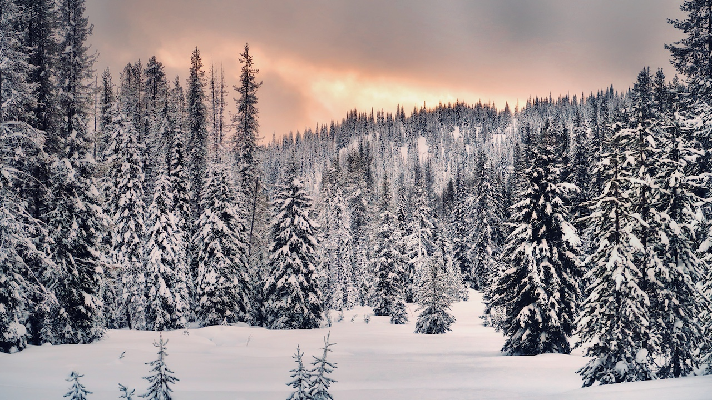

```{r setup, include=FALSE}
source("./R/setup.R")
```

## {-}

Welcome to the March 2019 Montana Drought & Climate newsletter. We hope that Montana farmers and ranchers find the information here useful. Please [send us your feedback](mailto:mtdrought@umontana.edu)!

Here's what you'll find in this newsletter:

[**Winter 2019 Update**](./review.html) --- Understanding current and past conditions aids in predicting future conditions. This section provides an overview of how this winter is progressing.

[**Spring 2019 Forecast**](./forecast.html) --- The seasonal forecast discusses predictions for temperature, precipitation, and drought, as well as the global air circulation patterns that impact growing conditions and water availability in Montana.

[**Reference**](./reference.html) --- A helpful glossary of terms found in this newsletter.

-----

### In Brief {-}

<div style="-webkit-columns: 2 300px;-moz-columns: 2 300px;columns: 2 300px;">
* Weak El Niño conditions formed during January 2019, based on the presence of above-average sea surface temperatures, and they are likely to persist into the spring.
* Temperatures this winter have been cooler than normal in the majority of western MT valley bottoms and for portions of north and south central Montana. Northeastern MT has experienced warmer than normal temperatures.
* Consistent with El Niño, snowpack west of the divide has been slightly lower than normal. For the plains region east of the divide, winter precipitation has been up to 250% of normal.
* The NOAA seasonal forecast, which takes El Niño and other current climate patterns into account, is for warmer conditions statewide this spring, with equal chances of above or below normal precipitation. Warmer temperatures tilt the odds towards earlier snowmelt and an earlier start to the growing season.
</div>

-----

### Mark your calendars!<br>MT Drought & Climate newsletter timing {-}
We traveled the state in summer 2018, meeting with farmers and ranchers in St. Ignatius, Chester, Harlowton, Fairfield, and Choteau. We wanted to learn more about your operations, what kind of climate information would be helpful to you, and when you would like to see it. Based on your feedback, we will provide this newsletter on March 1st, April 15th, June 1st, and October 15th.

-----

### We are listening! Soil moisture across Montana {-}

Soil moisture is notoriously difficult to measure and we have very few weather stations across Montana that can measure soil moisture. Recent advances in satellite monitoring now enable us to estimate root zone soil wetness to depths up to three feet, but only at coarse spatial scales of about six miles. These predictions are dependent upon measurements from the satellite and meteorological data that are combined to model soil moisture.
 
In our fall newsletter, this map of [SMAP satellite derived soil moisture](./reference.html) from September 1, 2018 showed a pattern of moisture trending from wetter in eastern portions of the state to drier in western Montana. A well-informed observer from Toole County (outlined in bold on the map) reported that soil moisture near the surface was much lower than the SMAP estimates. In this region much of the spring snowmelt ran off due to frozen soils and there was a deficit in summer precipitation. This discrepancy highlights the importance of local observations of soil moisture---including reports from our readers!---and of using multiple types of data when making decisions. To help with drought monitoring you can provide your own local observations at the [MT Drought Impacts reporter website: http://dnrc.mt.gov/divisions/water/drought-management](http://dnrc.mt.gov/divisions/water/drought-management).

```{r past-seasonal-smap-grid, cache=TRUE}

(mtd_plot_smap(date = "2018-09-01",
              variable = "sm_rootzone_wetness",
              data_out = "../data/SMAP")$map +
    ggplot2::geom_sf(data = mcor::mt_counties_simple %>%
                       dplyr::filter(County == "Toole"),
                   fill = NA,
                   color = "white",
                   size = 1)) %T>%
  save_mt_map("review_soil_moisture.pdf")

```

-----

### About **Montana Drought & Climate**<br>and the **Montana Climate Office** {-}
[Montana Drought & Climate](https://climate.umt.edu/mtdrought/) is a USDA-funded project of the [Montana Climate Office (MCO)](https://climate.umt.edu/) at the W.A. Franke College of Forestry & Conservation at the University of Montana, in collaboration with the Montana State University Extension Service. The MCO is an independent state-designated body that provides Montanans with high-quality, timely, relevant, and scientifically-based climate information and services. We strive to be a credible and expert source of information for decision makers that rely on the most current information on climate to make important decisions. It is also the role of the MCO to assist stakeholders in interpreting climate information or adapting climate products to their needs.

Production of this newsletter is supported by Water for Agriculture Challenge Area grant no. 2017-67027-26313 from the [USDA National Institute of Food and Agriculture](https://nifa.usda.gov/) and by the [Montana Water Center](http://www.montanawatercenter.org/). Any opinions, findings, conclusions, or recommendations expressed in this publication are those of the author(s) and do not necessarily reflect the view of the U.S. Department of Agriculture, the Montana Water Center, or the University of Montana. Please refer to the Montana Climate Office user agreement and disclaimer at [climate.umt.edu/disclaimer](http://climate.umt.edu/disclaimer/).

<br>
<div style="text-align: left;">
{style="width:400px;"}
</div>

-----

<br>
<a href="https://climate.umt.edu/" target="_blank">
  
</a>
[Montana Climate Office](https://climate.umt.edu/)<br>
Montana Forest & Conservation Experiment Station<br>
University of Montana<br>
32 Campus Drive<br>
Missoula, MT 59812<br>

P: (406) 243-6793<br>
E: [mtdrought@umontana.edu](mailto:mtdrought@umontana.edu)<br>
W: [http://climate.umt.edu/](http://climate.umt.edu/)
