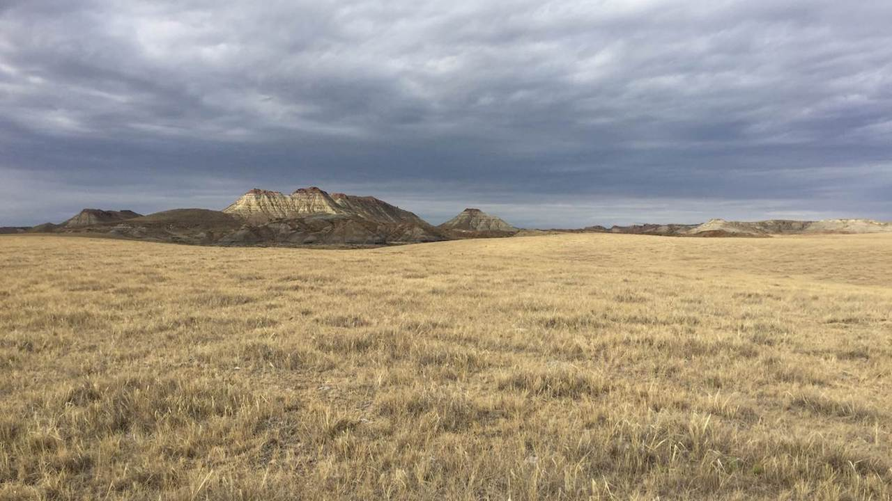

```{r setup, include=FALSE}
source("./R/setup.R")
```



## {- .tabset .tabset-fade .tabset-pills}

###  Climate {-}

Agriculture is an incredibly important part of Montana's culture, economy, and landscape, and an industry that is directly impacted by changes in temperature, precipitation, and extreme weather events. Each fall, we provide information about how environmental conditions in Montana are projected to change over the next 30 years. We realize that agricultural operations in Montana are diverse and that each producer will need to respond differently to changing conditions. Below, we provide information from the Montana Climate Assessment (MCA), an effort to synthesize, evaluate, and share credible and relevant scientific information about climate change in Montana, coordinated by the Montana Institute on Ecosystems, a statewide center based at both Montana State University and the University of Montana. **This is only a summary of the MCA** --- visit [MontanaClimate.org](https://montanaclimate.org/) for more details on how climate change may affect your region.

#### Climate basics
Climate is driven largely by energy from the sun, and how it is reflected, absorbed, transformed (as in photosynthesis), or re-radiated (as heat). Each of these processes influences climate through changes to temperature, the hydrologic cycle, vegetation, and atmospheric and ocean circulation patterns. Climate change encompasses both increases and decreases in temperature, as well as shifts in precipitation, changing risk of certain types of severe weather events, and changes to other features of the climate system.

Such changes are driven in large part by the greenhouse effect, the trapping of greenhouse gases in Earth's atmosphere and consequent warming of the planet. The rapid rate of climate change since the Industrial Revolution has resulted from changes in atmospheric chemistry, specifically increases in greenhouse gases due to increased combustion of fossil fuels, land-use change (e.g., deforestation), and fertilizer production. The primary greenhouse gases in the Earth's atmosphere are carbon dioxide (CO<sub>2</sub>), methane (CH<sub>4</sub>), nitrous oxide (N<sub>2</sub>O), water vapor (H<sub>2</sub>O), and ozone (O<sub>3</sub>). Here, we show data for two scenarios of future greenhouse gas emissions: one in which emissions continue to increase through the 21^st^ century ("business as usual"), and one in which emissions peak by the year 2040 and then decline ("stabilization").

#### Montana's unique features
To understand climate change in Montana, we must first understand Montana's unique geography. Montana is the fourth largest state in the nation and its location within North America exposes the state to a mix of diverse weather systems that originate from the Pacific Ocean, the Arctic, and sometimes subtropical regions. The Continental Divide, which has a predominantly north-south alignment in Montana, effectively splits the state into climatically distinct western wet and eastern dry regions with respect to moisture from eastward-flowing Pacific Maritime air. The state also includes the beginnings of three major river basins—the Missouri, Snake/Columbia, and Saskatchewan --- two of which encompass almost one-third of the landmass of the conterminous United States. Consequently, Montana's climate influences the water supply of a large portion of the country, and its water supports communities, ecosystems, and economies far beyond its borders. 

Montana's unique geography means that climate varies across the state, as it does across the nation. The MCA aggregates past climate trends and future climate projections into seven Montana climate divisions. These seven climate divisions are a subset of the 344 divisions defined by the National Oceanic and Atmospheric Administration (NOAA) based on a combination of climatic, political, agricultural, and watershed boundaries.

```{r climate-divisions, collapse=TRUE, results='hold', message=FALSE, warning=FALSE, cache=TRUE}

division_map <- 
  (
    ggplot2::ggplot() +
      mtd_plot(legend = FALSE) +
      geom_sf(data = mcor::mt_climate_divisions_simple,
              fill = "transparent",
              color = "black") +
      geom_text(data = mcor::mt_climate_divisions_simple %>% 
                  sf::st_centroid(),
                aes(x = (Shape %>% sf::st_coordinates())[,1],
                    y = (Shape %>% sf::st_coordinates())[,2],
                    label = Division),
                fontface = 2,
                size = 4)
  )

division_map %T>%
  save_mt_map("climate_divisions.pdf")
```

#### Key messages

These maps show the projected increase in annual average daily maximum temperature (°F) and annual total precipitation (in.) for each climate division in Montana for the periods 2040--2069 for (A) stabilization (RCP 4.5) and (B) business-as-usual (RCP 8.5) emission scenarios. Montana is projected to be much warmer in the future


Here are some key messages about Montana's historical and future climate from the MCA. Each message is followed by an [expression of confidence](./reference.html) in that message. For more information, see the [Climate chapter of the MCA](https://montanaclimate.org/chapter/climate-change).

- Annual average temperatures, including daily minimums, maximums, and averages, have risen across the state between 1950 and 2015. The increases range between 2.0--3.0°F during this period. [high agreement, robust evidence]
- Despite no historical changes in average annual precipitation between 1950 and 2015, there have been changes in average seasonal precipitation over the same period. Average winter precipitation decreased by 0.9 inches, which can largely be attributed to natural variability and an increase in El Niño events, especially in the western and central parts of the state. A significant increase in spring precipitation (1.3--2.0 inches) also occurred during this period for the eastern part of the state. [moderate agreement, robust evidence]
- Montana is projected to continue to warm in all geographic locations, seasons, and under all emission scenarios throughout the 21st century. By mid century, Montana temperatures are projected to increase by approximately 4.5--6.0°F depending on the emission scenario. These state-level changes are larger than the average changes projected globally and nationally. [high agreement, robust evidence]
- Across the state, precipitation is projected to increase in winter, spring, and fall; precipitation is projected to decrease in summer. The largest increases are expected to occur during spring in the southern part of the state. The largest decreases are expected to occur during summer in the central and southern parts of the state. [moderate agreement, moderate evidence]


###  Analogs {-}
**What will my climate be like in 2050?**

To better understand where your climate is heading, we’ve provided spatial analogs for three locations in Montana. Spatial analogs have become popular with agricultural producers because they provide a tangible and plausible representation of future climate in a particular place, based on what scientists currently know about how the climate is changing. For example, in 2050, it’s plausible that the climate of Fort Benton will similar to the current climate of the Utah Valley (Salt Lake City area). This information provides farmers and ranchers with an understanding of what kind of agriculture can thrive under future conditions.

**[INFOGRAPHIC HERE]**

###  Agriculture {-}

Agriculture is a key industry in Montana, generating over $3.5 billion in 2017 through the sale of agricultural commodities ([USDA NASS 2017](https://www.nass.usda.gov/Publications/AgCensus/2017/Online_Resources/County_Profiles/Montana/cp99030.pdf)). Montana's farm and ranchland support a mosaic of dryland and irrigated agriculture, commodity and specialty cropland, and native and planted rangeland. 

Montana agriculture has always faced volatility, extreme events, and variability across the state and these conditions will continue to be the case with projected climate changes in Montana. Climate projections show a warmer Montana in the future, with mixed changes in precipitation, more extreme events, and mixed certainty about upcoming drought. These changes will impact commodity crops, livestock, pollinators, disease, pests, and weeds. Predictions of climate impacts on agriculture are confounded by multiple sources of uncertainty including a) uncertainty in climate projections, b) uncertainty in agricultural conditions, and c) uncertainty in human responses. Climate impacts on agriculture in other regions of the world can also create uncertainty and have a major impact on Montana agriculture by changing commodity prices and input costs. Increasing uncertainty due to complex interactions, whether through volatility or new and hard-to-predict temperature and moisture trends, can disrupt agricultural decision-making and will probably become an even more important direct agriculture decision-driver in the years ahead.

The chart below illustrates some of the factors that drive agricultural decisions in Montana. The size of the arrows qualitatively represents the relative importance of each factor's influence on agricultural production decisions.


#### Key messages
Here are some key messages about how climate change will affect Montana agriculture. Each message is followed by an [expression of confidence](./reference.html) in that message. For more information, see the [Agriculture chapter of the MCA](https://montanaclimate.org/chapter/agriculture).

- Every component of agriculture---from prices to plant pollinators and crop pests---exhibits complex relationships to climate, depending on the location, weather variability, and agricultural and economic practices and policies. Social and economic resilience to withstand and adapt to variable conditions has always been a hallmark of Montana farmers’ and livestock producers’ strategies for coping with climate variability. [high agreement, robust evidence] 
- Decreasing mountain snowpack will continue to lead to decreased streamflow and less reliable irrigation capacity during the late growing season. Reduced irrigation capacity will have the greatest impact on hay, sugar beet, malt barley, market garden, and potato production across the state. [high agreement, robust evidence] 
- Increases in temperature will allow winter annual weeds, such as cheatgrass, to increase in distribution and frequency in winter wheat cropland and rangeland. Their spread will result in decreased crop yields and forage productivity as well as increased rangeland wildfire frequency. [high agreement, medium evidence] 
- Climate change affects global-price-determined commodity agriculture differently than it affects non-commodity agriculture. Commodity crops, such as small grains, are more directly driven by global markets and agricultural subsidies, whereas non-commodity crops tend to be more directly tied to local or specialized non-local markets and local micro-climates. [high agreement, medium evidence] 
- Diversified cropping systems, including rotation with pulse crops and innovations in tillage and cover-cropping, along with other measures to improve soil health, will continue to allow adaptation to climate change. [medium agreement, low evidence] 
