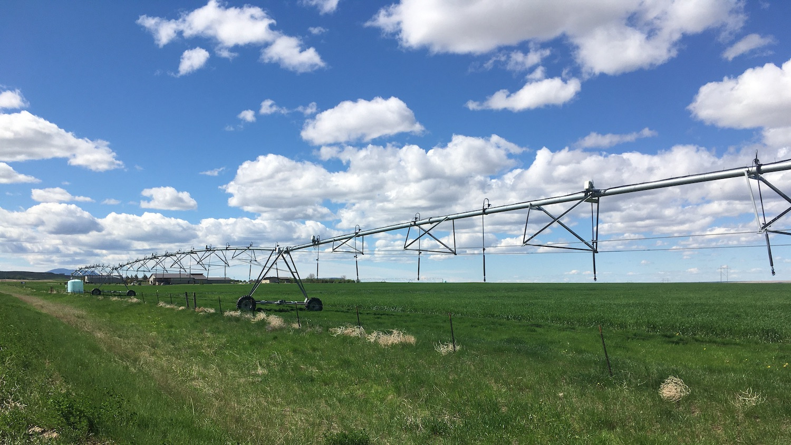

```{r setup, include=FALSE}
source("./R/setup.R")

```



## {- .tabset .tabset-fade .tabset-pills}

```{r load gridmet, cache=TRUE}
start_date <- "2020-04-01"
end_date <- "2020-06-15"

gridmet <- mtd_get_gridmet_ee(collection = "IDAHO_EPSCOR/GRIDMET",
                              vars = list("pr" = "sum",
                                          "tmmn" = "mean",
                                          "tmmx" = "mean"),
                              start_date = start_date,
                              end_date = end_date,
                              raw_dir = "../data/gridmet",
                              overwrite = FALSE)
# 
# gridmet <- mtd_get_gridmet(dates = c(start_date, end_date),
#                            raw_dir = "../data/gridmet")

# gridmet$pr %<>%
#   mm_to_in()
# 
# gridmet$tmmn %<>%
#   k_to_f()
# 
# gridmet$tmmx %<>%
#   k_to_f()
# 
# normals <- 
#   readr::read_rds("../data/gridmet/normals/gridmet_normals.Rds") %>%
#   purrr::map(
#     function(x){
#       x %>%
#         purrr::map(function(i){
#           i[[lubridate::as_date(attr(gridmet,"dates")) %>%
#                lubridate::yday()]]
#         })
#     }
#   )
# 
# normals$precipitation_amount %<>%
#   purrr::map(raster::calc, fun = base::sum, na.rm = TRUE) %>%
#   raster::brick() %>%
#   mm_to_in()
# 
# normals$daily_minimum_temperature %<>%
#   purrr::map(raster::calc, fun = base::mean, na.rm = TRUE) %>%
#   raster::brick() %>%
#   k_to_f()
# 
# normals$daily_maximum_temperature %<>%
#   purrr::map(raster::calc, fun = base::mean, na.rm = TRUE) %>%
#   raster::brick() %>%
#   k_to_f()
# 
# normals_projected <- normals %>%
#   purrr::map(raster::projectRaster, gridmet$pr, method = "ngb")
# 
# # gridmet_plain <- gridmet
# gridmet <- gridmet_plain
# 
# gridmet$pr %<>%
#   as.list() %>%
#   c(
#     normals_projected$precipitation_amount %>% 
#       as.list()
#   ) %>%
#   raster::brick()
# 
# gridmet$tmmn %<>%
#   as.list() %>%
#   c(
#     normals_projected$daily_minimum_temperature %>% 
#       as.list()
#   ) %>%
#   raster::brick()
# 
# gridmet$tmmx %<>%
#   as.list() %>%
#   c(
#     normals_projected$daily_maximum_temperature %>% 
#       as.list()
#   ) %>%
#   raster::brick()


# test <- readr::read_rds("../data/gridmet/normals/precipitation_amount.Rds")
# 
# out <-
#   tibble::tibble(
#     rasts = 
#       test %>%
#       as.list(),
#     year = 
#       test %>%
#       names() %>%
#       stringr::str_remove("X") %>%
#       lubridate::as_date() %>%
#       lubridate::year(),
#     day = 
#       test %>%
#       names() %>%
#       stringr::str_remove("X") %>%
#       lubridate::as_date() %>%
#       lubridate::yday()
#   ) %>%
#   dplyr::filter(day %in% (seq(lubridate::as_date(start_date),
#                               lubridate::as_date(end_date),
#                               "1 day") %>%
#                            lubridate::yday())) %>%
#   dplyr::group_by(year) %>%
#   dplyr::summarise(
#     rasts = list(
#       list(
#         mean = rasts %>%
#           raster::brick() %>%
#           mean() %>%
#           magrittr::set_names("normal.mean"),
#         
#         quantile = rasts %>%
#           raster::brick() %>%
#           calc(fun = quantile, na.rm = TRUE) %>%
#           magrittr::set_names(c("normal.000",  "normal.025",  "normal.050",  "normal.075",  "normal.100"))
#       ) %>%
#         raster::brick())
#   )
# 
# 
# (out$rasts %>%
#     purrr::reduce(`+`) %>%
#     mm_to_in())[["mean"]] %>%
#   raster::plot()


gridmet_series <- mtd_get_gridmet_series_ee(collection = "IDAHO_EPSCOR/GRIDMET", 
                                            vars = c("pr", "tmmn", "tmmx"),
                                            start_date = "2019-10-01", 
                                            end_date = "2020-09-30")

gridmet_series$pr %<>%
  dplyr::mutate_at(.vars = dplyr::vars(value:normal.100),
                   .funs = mm_to_in)

gridmet_series$tmmn %<>%
  dplyr::mutate_at(.vars = dplyr::vars(value:normal.100),
                   .funs = k_to_f)

gridmet_series$tmmx %<>%
  dplyr::mutate_at(.vars = dplyr::vars(value:normal.100),
                   .funs = k_to_f)

gridmet_sf <- gridmet %>%
  mtd_as_sf_gridmet() %>%
  purrr::map(sf::st_intersection,
             y = mt_state_simple)

attr(gridmet_sf,"dates") <- attr(gridmet,"dates")

```

###  Temperature {-}

```{r past-seasonal-temp-grid-normals, collapse=TRUE, results='hold', message=FALSE, warning=FALSE, cache=TRUE}

gridmet_sf %>%
  mtd_plot_gridmet(element = "tmean",
                   use_normal = TRUE) %>%
  save_mt_map("review_temperature.pdf")

```

```{r past-seasonal-temp-grid-normals-leaflet, fig.height=5, collapse=TRUE, results='hold', message=FALSE, warning=FALSE, cache=FALSE, out.extra=''}

gridmet$tmean <- (gridmet$tmmn + gridmet$tmmx)/2
names(gridmet$tmean) <- names(gridmet$tmmn)

past_seasonal_temp <- (gridmet$tmean$layer - gridmet$tmean$normal.mean)
attr(past_seasonal_temp,"dates") <- attr(gridmet,"dates")

past_seasonal_temp_map <- 
  mcor::mco_leaflet(x = past_seasonal_temp,
                    pal =  "-RdBu",
                    pane = "middleground",
                    legend_title = stringr::str_c(format(head(attr(past_seasonal_temp,"dates"), 1), '%B %d, %Y')," – ",
                                                  format(tail(attr(past_seasonal_temp,"dates"), 1), '%B %d, %Y'),"<br>",
                                                  "<a href='../reference.html' target='_blank'>Average temperature (ºF), deviation from normal</a>"),
                    image_query_title = "Temperature Deviation (ºF)",
                    reverse = TRUE,
                    midpoint = 0,
                    digits = 1)

past_seasonal_temp_map %>%
  saveWidgetFix("./figures/review_temperature.html", 
                selfcontained = FALSE,
                libdir = "./site_libs"
  )

if(knitr::is_html_output())
  knitr::include_url("./figures/review_temperature.html",
                     height = "500px")

```

<!-- <iframe id="review_temperature" src="./figures/review_temperature.html" width="100%" height="500px"> -->

Temperatures in April and May continued to be cooler than normal across Montana, especially in the plains. This has been driven by a pattern of cold storms over the last two months, which has led to retention of snow pack in the high country. However, things warmed up sharply in the final days of May, when much of the state experienced temperatures more typical of July or August.

The graph below compares historical daily temperatures (shaded bands and dashed lines) to current daily temperatures so far in 2020 (solid-jagged lines) across Montana. The shaded bands represent the range of recorded temperatures during the 1981--2010 period on any given day. The red bands and lines represent the high temperatures and the blues bands and lines represent the lows. The dashed red and blue lines represent the average high and average low temperatures during the 1981--2010 period.


```{r past-seasonal-temp-grid-climatology, cache=FALSE}
mtd_plot_climatology(x = gridmet_series[c("tmmn","tmmx")],
                     col = c("#0571b0","#ca0020"),
                     ybreaks = seq(-25,100,25),
                     title = "Temperature (ºF)",
                     polar = FALSE,
                     smooth = TRUE,
                     mean = TRUE) +
  ggplot2::geom_line(ggplot2::aes(x = date,
                                  y = value),
                     col = "#0571b0",
                     data = gridmet_series$tmmn %>%
                       na.omit(),
                     na.rm = TRUE) +
  ggplot2::geom_line(ggplot2::aes(x = date,
                                  y = value),
                     col = "#ca0020",
                     data = gridmet_series$tmmx %>%
                       na.omit(),
                     na.rm = TRUE)

ggplot2::ggsave("./figures/review_temperature_climate.pdf", width = 5.13, height = 2.49)

```

###  Precipitation {-}

```{r past-seasonal-prcp-grid-normals, collapse=TRUE, results='hold', message=FALSE, warning=FALSE, cache=TRUE}

gridmet_sf %>%
  mtd_plot_gridmet(element = "prcp",
                   use_normal = TRUE) %>%
  save_mt_map("review_precipitation.pdf")

```


```{r past-seasonal-prcp-grid-normals-leaflet, fig.height=5, collapse=TRUE, results='hold', message=FALSE, warning=FALSE, cache=FALSE, out.extra=''}

past_seasonal_prcp <- (gridmet$pr$layer / gridmet$pr$normal.mean) %>%
  magrittr::multiply_by(100) %>%
  round()
attr(past_seasonal_prcp,"dates") <- attr(gridmet,"dates")


mcor::mco_leaflet(x = past_seasonal_prcp,
                  pal =  "BrBG",
                  legend_title = stringr::str_c(format(head(attr(past_seasonal_prcp,"dates"),1), '%B %d, %Y')," – ",
                                                format(tail(attr(past_seasonal_prcp,"dates"),1), '%B %d, %Y'),"<br>",
                                                "<a href='../reference.html' target='_blank'>Net precipitation, % of normal</a>"),
                  image_query_title = "Net precipitation, percent of normal",
                  reverse = TRUE,
                  midpoint = 100,
                  digits = 0) %>%
  saveWidgetFix("./figures/review_precipitation.html", 
                selfcontained = FALSE,
                libdir = "./site_libs")

if(knitr::is_html_output())
  knitr::include_url("./figures/review_precipitation.html",
                     height = "500px")
```

<!-- <iframe id="review_precipitation" src="./figures/review_precipitation.html" width="100%" height="500px"> -->

Dry conditions have persisted across much of Montana, with the area around Dillon receiving only about 20% of its normal April--May precipitation. Meanwhile, portions of western Montana have seen upwards of 130% of normal precipitation for the same period. This pattern of precipitation has been the primary driver of current drought declarations in southwestern Montana.

The graph below compares historical daily precipitation (shaded band and dashed line) to current daily precipitation so far in 2020 (vertical bars) across Montana. The shaded band represent the range of recorded precipitation during the 1981--2010 period on any given day. The dashed line represents the average precipitation during the 1981--2010 period.

```{r past-seasonal-prcp-grid-climatology, cache=FALSE}
mtd_plot_climatology(x = gridmet_series[c("pr")],
                     col = c("forestgreen"),
                     ybreaks = seq(0,0.8,0.1),
                     title = "Precipitation (in.)",
                     polar = FALSE,
                     smooth = TRUE,
                     mean = TRUE,
                     family = tw()) +
  ggplot2::geom_col(mapping = ggplot2::aes(x = date,
                                           y = value),
                    col = "forestgreen",
                    data = gridmet_series$pr %>%
                      na.omit(),
                    na.rm = TRUE)

ggplot2::ggsave("./figures/review_precipitation_climate.pdf", width = 5.13, height = 2.49)

```

###  Soil Moisture {-}

```{r past-seasonal-smap-grid, collapse=TRUE, results='hide', message=FALSE, warning=FALSE, cache=TRUE}
smap <- mtd_plot_smap(date = "2020-06-15",
                      variable = "sm_rootzone_wetness",
                      data_out = "../data/SMAP")

smap$map %>%
  save_mt_map("review_soil_moisture.pdf")

```

```{r past-seasonal-smap-grid-leaflet, fig.height=5, collapse=TRUE, results='hold', message=FALSE, warning=FALSE, cache=FALSE, out.extra=''}
smap$leaflet %>%
  saveWidgetFix("./figures/review_soil_moisture.html",
                selfcontained = FALSE,
                libdir = "./site_libs"
  )

knitr::include_url("./figures/review_soil_moisture.html",
                   height = "500px")

```

Satellite-derived soil moisture estimates for the state track closely with the precipitation metrics going into the summer. Southwestern Montana around Dillon, southeastern Montana, and northeastern Montana are experiencing dry conditions early in the season.

### {width="35px"} Drought {-}

```{r past-seasonal-drought, cache=TRUE}

past_seasonal_drought <- mtd_plot_usdm(date = "2020-06-15",
                                       data_out = "../data/USDM")

past_seasonal_drought$map %T>%
  save_mt_map("review_drought.pdf")

```

The current US Drought Monitor has expanded its "abnormally dry" declaration to several areas of Montana, including across the southern part of the state, northeastern Montana, west of Kalispell, and north of Havre. Additionally, the USDM has categorized the area around Dillon as being under "moderate drought" conditions. Current dry conditions across the state coupled with forecasts of drier and warmer weather going into summer increase the likelihood of further expansion of drought declarations in the state.
