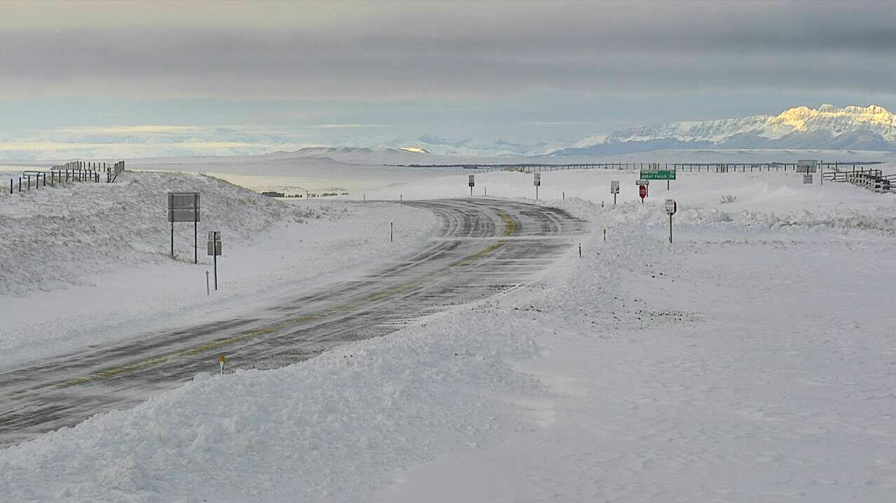

```{r setup, include=FALSE}
source("./R/setup.R")

```



## {- .tabset .tabset-fade .tabset-pills}

```{r load gridmet, cache=TRUE}
start_date <- "2019-06-01"
end_date <- "2019-10-01"

gridmet <- mtd_get_gridmet_ee(collection = "IDAHO_EPSCOR/GRIDMET",
                              vars = list("pr" = "sum",
                                          "tmmn" = "mean",
                                          "tmmx" = "mean"),
                              start_date = start_date,
                              end_date = end_date,
                              raw_dir = "../data/GRIDMET",
                              overwrite = FALSE)

# gridmet <- mtd_get_gridmet(dates = c(start_date, end_date),
#                            raw_dir = "../data/GRIDMET")

# gridmet$pr %<>%
#   mm_to_in()
# 
# gridmet$tmmn %<>%
#   k_to_f()
# 
# gridmet$tmmx %<>%
#   k_to_f()
# 
# normals <- 
#   readr::read_rds("../data/gridmet/normals/gridmet_normals.Rds") %>%
#   purrr::map(
#     function(x){
#       x %>%
#         purrr::map(function(i){
#           i[[lubridate::as_date(attr(gridmet,"dates")) %>%
#                lubridate::yday()]]
#         })
#     }
#   )
# 
# normals$precipitation_amount %<>%
#   purrr::map(raster::calc, fun = base::sum, na.rm = TRUE) %>%
#   raster::brick() %>%
#   mm_to_in()
# 
# normals$daily_minimum_temperature %<>%
#   purrr::map(raster::calc, fun = base::mean, na.rm = TRUE) %>%
#   raster::brick() %>%
#   k_to_f()
# 
# normals$daily_maximum_temperature %<>%
#   purrr::map(raster::calc, fun = base::mean, na.rm = TRUE) %>%
#   raster::brick() %>%
#   k_to_f()
# 
# normals_projected <- normals %>%
#   purrr::map(raster::projectRaster, gridmet$pr, method = "ngb")
# 
# # gridmet_plain <- gridmet
# gridmet <- gridmet_plain
# 
# gridmet$pr %<>%
#   as.list() %>%
#   c(
#     normals_projected$precipitation_amount %>% 
#       as.list()
#   ) %>%
#   raster::brick()
# 
# gridmet$tmmn %<>%
#   as.list() %>%
#   c(
#     normals_projected$daily_minimum_temperature %>% 
#       as.list()
#   ) %>%
#   raster::brick()
# 
# gridmet$tmmx %<>%
#   as.list() %>%
#   c(
#     normals_projected$daily_maximum_temperature %>% 
#       as.list()
#   ) %>%
#   raster::brick()


# test <- readr::read_rds("../data/gridmet/normals/precipitation_amount.Rds")
# 
# out <-
#   tibble::tibble(
#     rasts = 
#       test %>%
#       as.list(),
#     year = 
#       test %>%
#       names() %>%
#       stringr::str_remove("X") %>%
#       lubridate::as_date() %>%
#       lubridate::year(),
#     day = 
#       test %>%
#       names() %>%
#       stringr::str_remove("X") %>%
#       lubridate::as_date() %>%
#       lubridate::yday()
#   ) %>%
#   dplyr::filter(day %in% (seq(lubridate::as_date(start_date),
#                               lubridate::as_date(end_date),
#                               "1 day") %>%
#                            lubridate::yday())) %>%
#   dplyr::group_by(year) %>%
#   dplyr::summarise(
#     rasts = list(
#       list(
#         mean = rasts %>%
#           raster::brick() %>%
#           mean() %>%
#           magrittr::set_names("normal.mean"),
#         
#         quantile = rasts %>%
#           raster::brick() %>%
#           calc(fun = quantile, na.rm = TRUE) %>%
#           magrittr::set_names(c("normal.000",  "normal.025",  "normal.050",  "normal.075",  "normal.100"))
#       ) %>%
#         raster::brick())
#   )
# 
# 
# (out$rasts %>%
#     purrr::reduce(`+`) %>%
#     mm_to_in())[["mean"]] %>%
#   raster::plot()


gridmet_series <- mtd_get_gridmet_series_ee(collection = "IDAHO_EPSCOR/GRIDMET", 
                                            vars = c("pr", "tmmn", "tmmx"),
                                            start_date = "2019-01-01", 
                                            end_date = "2019-12-31")

gridmet_series$pr %<>%
  dplyr::mutate_at(.vars = dplyr::vars(value:normal.100),
                   .funs = mm_to_in)

gridmet_series$tmmn %<>%
  dplyr::mutate_at(.vars = dplyr::vars(value:normal.100),
                   .funs = k_to_f)

gridmet_series$tmmx %<>%
  dplyr::mutate_at(.vars = dplyr::vars(value:normal.100),
                   .funs = k_to_f)

gridmet_sf <- gridmet %>%
  mtd_as_sf_gridmet() %>%
  purrr::map(sf::st_intersection,
             y = mt_state_simple)
attr(gridmet_sf,"dates") <- attr(gridmet,"dates")

```

###  Temperature {-}

```{r past-seasonal-temp-grid-normals, collapse=TRUE, results='hold', message=FALSE, warning=FALSE, cache=TRUE}

gridmet_sf %>%
  mtd_plot_gridmet(element = "tmean",
                   use_normal = TRUE) %>%
  save_mt_map("review_temperature.pdf")

```

```{r past-seasonal-temp-grid-normals-leaflet, fig.height=5, collapse=TRUE, results='hold', message=FALSE, warning=FALSE, cache=FALSE, out.extra=''}

gridmet$tmean <- (gridmet$tmmn + gridmet$tmmx)/2
names(gridmet$tmean) <- names(gridmet$tmmn)

past_seasonal_temp <- (gridmet$tmean$value - gridmet$tmean$normal.mean)
attr(past_seasonal_temp,"dates") <- attr(gridmet,"dates")

past_seasonal_temp_map <- 
  mtd_leaflet(x = past_seasonal_temp,
              pal =  "-RdBu",
              legend_title = stringr::str_c(format(head(attr(past_seasonal_temp,"dates"), 1), '%B %d, %Y')," – ",
                                            format(tail(attr(past_seasonal_temp,"dates"), 1), '%B %d, %Y'),"<br>",
                                            "<a href='../reference.html' target='_blank'>Average temperature (ºF), deviation from normal</a>"),
              image_query_title = "Temperature Deviation (ºF)",
              reverse = TRUE,
              midpoint = 0,
              digits = 1)

past_seasonal_temp_map %>%
  saveWidgetFix("./figures/review_temperature.html", 
                selfcontained = FALSE,
                libdir = "./site_libs"
  )

knitr::include_url("./figures/review_temperature.html",
                   height = "500px")

```

<!-- <iframe id="review_temperature" src="./figures/review_temperature.html" width="100%" height="500px"> -->

Eastern and western Montana experienced very different conditions this past summer. East of the Rockies much of Montana was cooler than normal in June through September, while western Montana saw warmer than normal temperatures—especially at high elevations. Widespread, cold storms led to lower than normal daytime temperatures during late summer, with less heat available to crops during the growing season. Late September brought an historic early fall snow storm to Montana, with over four feet of snow falling in Browning.

The graph below compares historical daily temperatures (shaded bands and dashed lines) to current daily temperatures so far in 2019 (solid-jagged lines) across Montana. The shaded bands represent the range of recorded temperatures during the 1981–2010 period on any given day. The red bands and lines represent the high temperatures and the blues bands and lines represent the lows. The dashed red and blue lines represent the average high and average low temperatures during the 1981–2010 period.


```{r past-seasonal-temp-grid-climatology, cache=FALSE}
mtd_plot_climatology(x = gridmet_series[c("tmmn","tmmx")],
                     col = c("#0571b0","#ca0020"),
                     ybreaks = seq(-25,100,25),
                     title = "Temperature (ºF)",
                     polar = FALSE,
                     smooth = TRUE,
                     mean = TRUE) +
  ggplot2::geom_line(ggplot2::aes(x = day,
                                  y = value),
                     col = "#0571b0",
                     data = gridmet_series$tmmn %>%
                       na.omit(),
                     na.rm = TRUE) +
  ggplot2::geom_line(ggplot2::aes(x = day,
                                  y = value),
                     col = "#ca0020",
                     data = gridmet_series$tmmx %>%
                       na.omit(),
                     na.rm = TRUE)

ggplot2::ggsave("./figures/review_temperature_climate.pdf")
```

###  Precipitation {-}

```{r past-seasonal-prcp-grid-normals, collapse=TRUE, results='hold', message=FALSE, warning=FALSE, cache=TRUE}

gridmet_sf %>%
  mtd_plot_gridmet(element = "prcp",
                   use_normal = TRUE) %>%
  save_mt_map("review_precipitation.pdf")

```


```{r past-seasonal-prcp-grid-normals-leaflet, fig.height=5, collapse=TRUE, results='hold', message=FALSE, warning=FALSE, cache=FALSE, out.extra=''}

past_seasonal_prcp <- (gridmet$pr$value / gridmet$pr$normal.mean) %>%
  magrittr::multiply_by(100) %>%
  round()
attr(past_seasonal_prcp,"dates") <- attr(gridmet,"dates")


mtd_leaflet(x = past_seasonal_prcp,
            pal =  "BrBG",
            legend_title = stringr::str_c(format(head(attr(past_seasonal_prcp,"dates"),1), '%B %d, %Y')," – ",
                                          format(tail(attr(past_seasonal_prcp,"dates"),1), '%B %d, %Y'),"<br>",
                                          "<a href='../reference.html' target='_blank'>Net precipitation, % of normal</a>"),
            image_query_title = "Net precipitation, percent of normal",
            reverse = TRUE,
            midpoint = 100,
            digits = 0) %>%
  saveWidgetFix("./figures/review_precipitation.html", 
                selfcontained = FALSE,
                libdir = "./site_libs")

knitr::include_url("./figures/review_precipitation.html",
                   height = "500px")
# addLogo("../img/MCO_logo.svg", 
#         src = "local", 
#         width = 200, 
#         position = "topright") %T>%
# 

```

<!-- <iframe id="review_precipitation" src="./figures/review_precipitation.html" width="100%" height="500px"> -->

The big story of the summer was the rain in eastern Montana. The Upper Missouri River Basin saw one of its wettest summers on record, and observed runoff in September near Sioux City, Iowa, was more than 16 times the long term average and more than twice the previous record. The agricultural impacts of these record conditions were substantial. Where flooding occurred along the Missouri River, wet and cool conditions led to delayed maturity, grain sprouting in silos, moisture-related crop disease, and field inundation. Conditions were slightly drier than normal across western Montana, but residual moisture from a wet winter and spring led to a mercifully calm fire season in the northern Rockies.

The graph below compares historical daily precipitation (shaded band and dashed line) to current daily precipitation so far in 2019 (vertical bars) across Montana. The shaded band represent the range of recorded precipitation during the 1981–2010 period on any given day. The dashed line represents the average precipitation during the 1981–2010 period.

```{r past-seasonal-prcp-grid-climatology, cache=FALSE}
mtd_plot_climatology(x = gridmet_series[c("pr")],
                     col = c("forestgreen"),
                     ybreaks = seq(0,0.8,0.1),
                     title = "Precipitation (in.)",
                     polar = FALSE,
                     smooth = TRUE,
                     mean = TRUE,
                     family = tw()) +
  ggplot2::geom_col(mapping = ggplot2::aes(x = day,
                                           y = value),
                    col = "forestgreen",
                    data = gridmet_series$pr %>%
                      na.omit(),
                    na.rm = TRUE)

ggplot2::ggsave("./figures/review_precipitation_climate.pdf")

```

<!-- ### {width="35px"} Snowpack {-} -->

<!-- ```{r past-seasonal-swe, collapse=TRUE, message=FALSE, warning=FALSE, cache=FALSE, out.extra=''} -->
<!-- past_seasonal_swe <- mtd_plot_swe_basins(date = "2019-10-31", huc = 8) -->


<!-- knitr::include_url(past_seasonal_swe$leaflet$path, -->
<!--                    height = "500px") -->

<!-- ``` -->

<!-- <iframe id="past_seasonal_swe" src="./figures/2019-02-11-swe.html" width="100%" height="500px"> -->

<!-- Wet and warmer conditions across western Montana have accelerated snowmelt—most basins now have less snowpack than normal, ranging from ~11% of normal in the Yaak basin in far northwestern Montana to upward of 200% of normal in the Upper Tongue and Big Horn Lake basins. Several basins in central Montana remain slightly higher than normal thanks to exceptional snowpack and cooler temperatures earlier this spring. -->

###  Soil Moisture {-}

```{r past-seasonal-smap-grid, collapse=TRUE, results='hide', message=FALSE, warning=FALSE, cache=TRUE}
smap <- mtd_plot_smap(date = "2019-10-01",
                      variable = "sm_rootzone_wetness",
                      data_out = "../data/SMAP")

smap$map %>%
  save_mt_map("review_soil_moisture.pdf")

```

```{r past-seasonal-smap-grid-leaflet, fig.height=5, collapse=TRUE, results='hold', message=FALSE, warning=FALSE, cache=FALSE, out.extra=''}
smap$leaflet %>%
  saveWidgetFix("./figures/review_soil_moisture.html",
                selfcontained = FALSE,
                libdir = "./site_libs"
  )

knitr::include_url("./figures/review_soil_moisture.html",
                   height = "500px")

```

Cool temperatures and high precipitation have led to truly historic soil moisture conditions across central and eastern Montana going into the fall. Soils east of the continental divide are nearly saturated, and are likely to stay very wet into the winter. Impacts include increased flooding during fall snow storms, difficulty planting winter wheat, and the increased likelihood of significant flooding events and planting delays this coming spring as snow melts on frozen or saturated soils. As of early October, Montana producers had only sown 50% their intended winter wheat acreage and only 9% had emerged --- usually 75% has been sown by early October, with 35% emerged. Cool temperatures and the soil moisture surplus will likely continue to delay or prohibit fall planting.

<!-- ### {width="35px"} Drought {-} -->

<!-- ```{r past-seasonal-drought, cache=TRUE} -->

<!-- past_seasonal_drought <- mtd_plot_usdm(date = "2019-10-15", -->
<!--                                        data_out = "../data/USDM") -->

<!-- past_seasonal_drought$map %T>% -->
<!--   save_mt_map("review_drought.pdf") -->

<!-- ``` -->

<!-- The US Drought Monitor has categorized northwestern and northeastern Montana as abnormally dry going into early summer, and portions of northwestern Montana as experiencing moderate drought. This aligns with the evapotranspiration patterns and precipitation deficits from earlier this spring. -->
