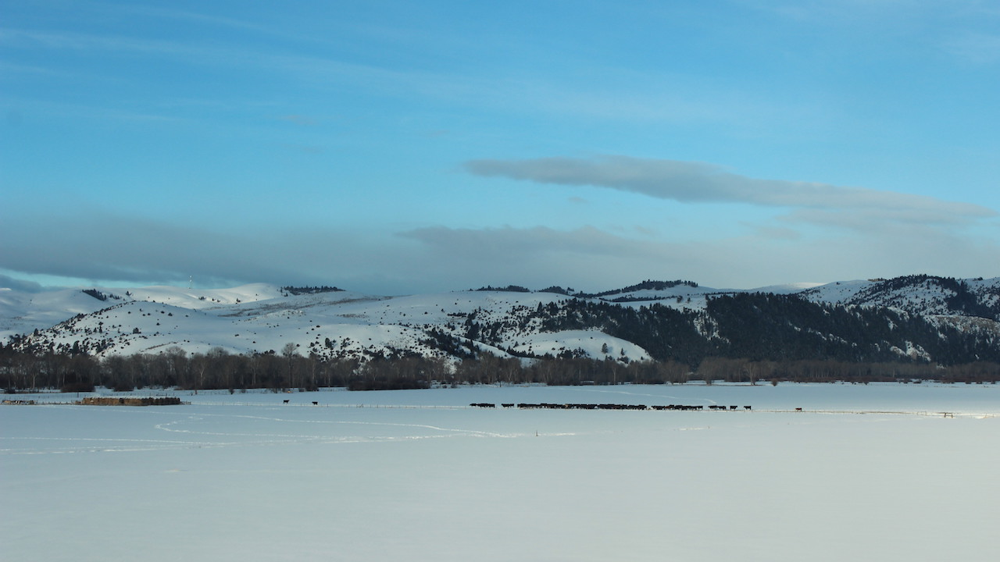

```{r setup, include=FALSE}
source("./R/setup.R")

```



## {- .tabset .tabset-fade .tabset-pills}

```{r load gridmet, cache=TRUE}
start_date <- "2019-04-01"
end_date <- "2019-06-01"

gridmet <- mtd_get_gridmet_ee(collection = "IDAHO_EPSCOR/GRIDMET",
                              vars = list("pr" = "sum",
                                          "tmmn" = "mean",
                                          "tmmx" = "mean"),
                              start_date = start_date,
                              end_date = end_date,
                              raw_dir = "../data/GRIDMET",
                              overwrite = FALSE)

gridmet$pr %<>%
  mm_to_in()

gridmet$tmmn %<>%
  k_to_f()

gridmet$tmmx %<>%
  k_to_f()

normals <- 
  readr::read_rds("../data/gridmet/normals/gridmet_normals.Rds") %>%
  purrr::map(
    function(x){
      x %>%
        purrr::map(function(i){
          i[[lubridate::as_date(attr(gridmet,"dates")) %>%
               lubridate::yday()]]
        })
    }
  )

normals$precipitation_amount %<>%
  purrr::map(raster::calc, sum, na.rm = TRUE) %>%
  raster::brick() %>%
  mm_to_in()

normals$daily_minimum_temperature %<>%
  purrr::map(raster::calc, mean, na.rm = TRUE) %>%
  raster::brick() %>%
  k_to_f()

normals$daily_maximum_temperature %<>%
  purrr::map(raster::calc, mean, na.rm = TRUE) %>%
  raster::brick() %>%
  k_to_f()

normals %<>%
  purrr::map(raster::projectRaster, gridmet$pr)

gridmet$pr %<>%
  as.list() %>%
  c(
    normals$precipitation_amount %>% 
      as.list()
  ) %>%
  raster::brick()

gridmet$tmmn %<>%
  as.list() %>%
  c(
    normals$daily_minimum_temperature %>% 
      as.list()
  ) %>%
  raster::brick()

gridmet$tmmx %<>%
  as.list() %>%
  c(
    normals$daily_maximum_temperature %>% 
      as.list()
  ) %>%
  raster::brick()


# test <- readr::read_rds("../data/gridmet/normals/precipitation_amount.Rds")
# 
# out <-
#   tibble::tibble(
#     rasts = 
#       test %>%
#       as.list(),
#     year = 
#       test %>%
#       names() %>%
#       stringr::str_remove("X") %>%
#       lubridate::as_date() %>%
#       lubridate::year(),
#     day = 
#       test %>%
#       names() %>%
#       stringr::str_remove("X") %>%
#       lubridate::as_date() %>%
#       lubridate::yday()
#   ) %>%
#   dplyr::filter(day %in% (seq(lubridate::as_date(start_date),
#                               lubridate::as_date(end_date),
#                               "1 day") %>%
#                            lubridate::yday())) %>%
#   dplyr::group_by(year) %>%
#   dplyr::summarise(
#     rasts = list(
#       list(
#         mean = rasts %>%
#           raster::brick() %>%
#           mean() %>%
#           magrittr::set_names("normal.mean"),
#         
#         quantile = rasts %>%
#           raster::brick() %>%
#           calc(fun = quantile, na.rm = TRUE) %>%
#           magrittr::set_names(c("normal.000",  "normal.025",  "normal.050",  "normal.075",  "normal.100"))
#       ) %>%
#         raster::brick())
#   )
# 
# 
# (out$rasts %>%
#     purrr::reduce(`+`) %>%
#     mm_to_in())[["mean"]] %>%
#   raster::plot()


gridmet_series <- mtd_get_gridmet_series_ee(collection = "IDAHO_EPSCOR/GRIDMET", 
                                            vars = c("pr", "tmmn", "tmmx"),
                                            start_date = "2019-01-01", 
                                            end_date = "2019-12-31")

gridmet_series$pr %<>%
  dplyr::mutate_at(.vars = dplyr::vars(value:normal.100),
                   .funs = mm_to_in)

gridmet_series$tmmn %<>%
  dplyr::mutate_at(.vars = dplyr::vars(value:normal.100),
                   .funs = k_to_f)

gridmet_series$tmmx %<>%
  dplyr::mutate_at(.vars = dplyr::vars(value:normal.100),
                   .funs = k_to_f)

gridmet_sf <- gridmet %>%
  mtd_as_sf_gridmet() %>%
  purrr::map(sf::st_intersection,
             y = mt_state_simple)
attr(gridmet_sf,"dates") <- attr(gridmet,"dates")

```

###  Temperature {-}
Brrrr! February and early March brought near-record lows across Montana, with some areas more than 30ºF below normal temperatures. These extreme cold temperatures bring benefits beyond good ski conditions---Montana's snowpack was able to rebound from a slow start in early winter, and the deep freezes likely killed mountain pine beetle populations that have been attacking Montana forests since the late 1990s. Cold temperatures in February made for a hard start to the calving season. Producers were forced thaw water supplies and supplement cows and calves with additional feed. Many put up wind breaks and plenty of straw to keep cows and calves as warm and dry as possible. Temperatures have warmed since mid-March, however, and are now normal or slightly warmer than normal across the state.
```{r past-seasonal-temp-grid-normals, collapse=TRUE, results='hold', message=FALSE, warning=FALSE, cache=TRUE}

gridmet_sf %>%
  mtd_plot_gridmet(element = "tmean",
                   use_normal = TRUE) %>%
  save_mt_map("review_temperature.pdf")

```

```{r past-seasonal-temp-grid-normals-leaflet, fig.height=5, collapse=TRUE, results='hold', message=FALSE, warning=FALSE, cache=FALSE, out.extra=''}

gridmet$tmean <- (gridmet$tmmn + gridmet$tmmx)/2
names(gridmet$tmean) <- names(gridmet$tmmn)

past_seasonal_temp <- (gridmet$tmean$value - gridmet$tmean$mean)
attr(past_seasonal_temp,"dates") <- attr(gridmet,"dates")

past_seasonal_temp_map <- 
  mtd_leaflet(x = past_seasonal_temp,
              pal =  "-RdBu",
              legend_title = stringr::str_c(format(head(attr(past_seasonal_temp,"dates"), 1), '%B %d, %Y')," – ",
                                            format(tail(attr(past_seasonal_temp,"dates"), 1), '%B %d, %Y'),"<br>",
                                            "<a href='../reference.html' target='_blank'>Average temperature (ºF), deviation from normal</a>"),
              image_query_title = "Temperature Deviation (ºF)",
              reverse = TRUE,
              midpoint = 0,
              digits = 1)

past_seasonal_temp_map %>%
  saveWidgetFix("./figures/review_temperature.html", 
                selfcontained = FALSE,
                libdir = "./site_libs"
  )

knitr::include_url("./figures/review_temperature.html",
                   height = "500px")

```

<!-- <iframe id="review_temperature" src="./figures/review_temperature.html" width="100%" height="500px"> -->

The graph below compares historical daily temperatures (shaded bands and dashed lines) to current daily temperatures so far in 2019 (solid-jagged lines) across Montana. The shaded bands represent the range of recorded temperatures during the 1981--2010 period on any given day. The red bands and lines represent the high temperatures and the blues bands and lines represent the lows. The dashed red and blue lines represent the average high and average low temperatures during the 1981--2010 period.

```{r past-seasonal-temp-grid-climatology, cache=FALSE}
gridmet_sum <-
  gridmet %>%
  purrr::map(raster::cellStats, 
             stat = mean,
             na.rm = TRUE)

mtd_plot_climatology(x = gridmet_series[c("tmmn","tmmx")],
                     col = c("#0571b0","#ca0020"),
                     ybreaks = seq(-25,100,25),
                     title = "Temperature (ºF)",
                     polar = FALSE,
                     smooth = TRUE,
                     mean = TRUE) +
  ggplot2::geom_line(ggplot2::aes(x = day,
                                  y = value),
                     col = "#0571b0",
                     data = gridmet_series$tmmn %>%
                       na.omit(),
                     na.rm = TRUE) +
  ggplot2::geom_line(ggplot2::aes(x = day,
                                  y = value),
                     col = "#ca0020",
                     data = gridmet_series$tmmx %>%
                       na.omit(),
                     na.rm = TRUE)

ggplot2::ggsave("./figures/review_temperature_climate.pdf")
```

###  Precipitation {-}
Although February brought several large winter storms to Montana, March has been drier than normal, leading to overall drier conditions during late winter. The exception is north-eastern Montana, portions of which have experienced over 300% of normal precipitation for February through Early April.

```{r past-seasonal-prcp-grid-normals, collapse=TRUE, results='hold', message=FALSE, warning=FALSE, cache=TRUE}

gridmet_sf %>%
  mtd_plot_gridmet(element = "prcp",
                   use_normal = TRUE) %>%
  save_mt_map("review_precipitation.pdf")
```


```{r past-seasonal-prcp-grid-normals-leaflet, fig.height=5, collapse=TRUE, results='hold', message=FALSE, warning=FALSE, cache=FALSE, out.extra=''}

past_seasonal_prcp <- (gridmet$pr$value / gridmet$pr$mean) %>%
  magrittr::multiply_by(100) %>%
  round()
attr(past_seasonal_prcp,"dates") <- attr(gridmet,"dates")


mtd_leaflet(past_seasonal_prcp,
            pal =  "BrBG",
            legend_title = stringr::str_c(format(head(attr(past_seasonal_prcp,"dates"),1), '%B %d, %Y')," – ",
                                          format(tail(attr(past_seasonal_prcp,"dates"),1), '%B %d, %Y'),"<br>",
                                          "<a href='../reference.html' target='_blank'>Net precipitation, % of normal</a>"),
            image_query_title = "Net precipitation, percent of normal",
            reverse = TRUE,
            midpoint = 100,
            digits = 0) %>%
  saveWidgetFix("./figures/review_precipitation.html", 
                selfcontained = FALSE,
                libdir = "./site_libs")

knitr::include_url("./figures/review_precipitation.html",
                   height = "500px")
# addLogo("../img/MCO_logo.svg", 
#         src = "local", 
#         width = 200, 
#         position = "topright") %T>%
# 

```

<!-- <iframe id="review_precipitation" src="./figures/review_precipitation.html" width="100%" height="500px"> -->

The graph below compares historical daily precipitation (shaded band and dashed line) to current daily precipitation so far in 2019 (vertical bars) across Montana. The shaded band represent the range of recorded precipitation during the 1981--2010 period on any given day. The dashed line represents the average precipitation during the 1981--2010 period.

```{r past-seasonal-prcp-grid-climatology, cache=FALSE}
mtd_plot_climatology(x = gridmet_series[c("pr")],
                     col = c("forestgreen"),
                     ybreaks = seq(0,0.8,0.1),
                     title = "Precipitation (in.)",
                     polar = FALSE,
                     smooth = TRUE,
                     mean = TRUE,
                     family = tw()) +
  ggplot2::geom_col(mapping = ggplot2::aes(x = day,
                                           y = value),
                    col = "forestgreen",
                    data = gridmet_series$pr %>%
                      na.omit(),
                    na.rm = TRUE)

ggplot2::ggsave("./figures/review_precipitation_climate.pdf")

```

### {width="35px"} Snowpack {-}

Snowpack across western Montana continues to diverge along a line from roughly Lolo to Great Falls, with increasingly lower than average Snow Water Equivalent (SWE) in northwest Montana (80%–100%), and higher than average SWE for southern and central Montana (100%–120%). The timing and extent of storms in April---and whether they bring predominately snow or rain---will largely determine how long the snowpack is retained into the late spring. Continue to pay attention to spring temperatures, since they impact the timing of snowmelt and flooding.

```{r past-seasonal-swe, collapse=TRUE, message=FALSE, warning=FALSE, cache=FALSE, out.extra=''}

past_seasonal_swe <- mtd_plot_swe_basins(date = "2019-06-01", huc = 8)


knitr::include_url(past_seasonal_swe$leaflet$path,
                   height = "500px")

```

<!-- <iframe id="past_seasonal_swe" src="./figures/2019-02-11-swe.html" width="100%" height="500px"> -->

<!-- ###  Soil Moisture {-} -->
<!-- As Montana thaws after a long winter, soil moisture measurements from weather stations and satellite data become more accurate. Soil moisture is factored into drought and flood forecasts as an indicator of wet or dry basin conditions. We are seeing typical soil moisture conditions for early spring across Montana. The majority of Montana currently has very saturated soil (the blue areas in the map below). Soils in southwestern Montana are drier than the rest of the state; the extreme dry spots in northeastern Montana are noise in the data that will become more accurate as conditions warm. As we move into spring, daytime temperatures and the intensity of spring storms will greatly determine how soil moisture conditions change across the state. -->

<!-- ```{r past-seasonal-smap-grid, collapse=TRUE, results='hide', message=FALSE, warning=FALSE, cache=TRUE} -->

<!-- smap <- mtd_plot_smap(date = "2019-06-01", -->
<!--                       variable = "sm_rootzone_wetness", -->
<!--                       data_out = "../data/SMAP") -->

<!-- smap$map %>% -->
<!--   save_mt_map("review_soil_moisture.pdf") -->

<!-- ``` -->

<!-- ```{r past-seasonal-smap-grid-leaflet, fig.height=5, collapse=TRUE, results='hold', message=FALSE, warning=FALSE, cache=FALSE, out.extra=''} -->
<!-- smap$leaflet %>% -->
<!--   saveWidgetFix("./figures/review_soil_moisture.html",  -->
<!--                 selfcontained = FALSE, -->
<!--                 libdir = "./site_libs" -->
<!--   ) -->

<!-- knitr::include_url("./figures/review_soil_moisture.html", -->
<!--                    height = "500px") -->

<!-- ``` -->

###  Evapotranspiration {-}

Evapotranspiration (ET), or the amount of water vapor leaving the Earth's surface through evaporation and plant photosynthesis, reflects both the amount of plant-available water and the atmospheric demand for water (i.e., how dry the air is). The plot and graph below show the deviation from normal ET at the end of this summer. In the map, the green areas experienced greater amounts of ET than their normal amounts from 2000--2016 (the period of record); the brown areas experienced less ET.

```{r past-seasonal-ET, cache=TRUE}
mod16_2019 <- mtd_get_mod16a2(start_date = "2019-01-01", 
                              end_date = "2019-12-31", 
                              base_name = 'MOD16A2',
                              raw_dir = "../data/MOD16A2",
                              overwrite = FALSE)

# mod16_2018[][is.na(mod16_2018[])] <- 0

mod16_2019 %<>%
  mcor::mco_mask(mcor::mt_state)

ET_date <- mod16_2019 %>%
  names() %>%
  stringr::str_remove("X") %>%
  lubridate::as_date()

mod16_2018 <- mtd_get_mod16a2(start_date = "2018-01-01", 
                              end_date = "2018-12-31", 
                              base_name = 'MOD16A2',
                              raw_dir = "../data/MOD16A2",
                              overwrite = FALSE)

# mod16_2017[][is.na(mod16_2017[])] <- 0

mod16_2018 %<>%
  mcor::mco_mask(mcor::mt_state)

mod16_normals <-
  mtd_get_mod16a2_normals(base_name = 'MOD16A2',
                          raw_dir = "../data/MOD16A2",
                          overwrite = FALSE)

# mod16_normals %<>%
#   purrr::map(function(x){
#     x[][is.na(x[])] <- 0
#     x
#   })

mod16_normals %<>%
  purrr::map(mcor::mco_mask,
             mcor::mt_state)

mod16_normals_summary <-
  mod16_normals %>%
  purrr::map(mtd_aggregate_normals) %>%
  tibble::as_tibble() %>%
  dplyr::mutate(YDAY = seq(1, 365, 8))

mod16_2019_summary <- tibble::tibble(mean = mod16_2019 %>%
                                       mtd_aggregate_normals(),
                                     YDAY = names(mod16_2019) %>%
                                       stringr::str_remove("X") %>%
                                       lubridate::as_date() %>%
                                       lubridate::yday())

mod16_2018_summary <- tibble::tibble(mean = mod16_2018 %>%
                                       mtd_aggregate_normals(),
                                     YDAY = names(mod16_2018) %>%
                                       stringr::str_remove("X") %>%
                                       lubridate::as_date() %>%
                                       lubridate::yday())

mod16_2019_dev <- mod16_2019 - mod16_normals$p50[[names(mod16_2019) %>%
                                                    stringr::str_remove("X") %>%
                                                    lubridate::as_date() %>%
                                                    lubridate::yday() %>%
                                                    stringr::str_c("X",.)]]
mod16_2018_dev <- mod16_2018 - mod16_normals$p50[[names(mod16_2018) %>%
                                                    stringr::str_remove("X") %>%
                                                    lubridate::as_date() %>%
                                                    lubridate::yday() %>%
                                                    stringr::str_c("X",.)]]

mod16_normals_summary_dev <- mod16_normals_summary %>%
  dplyr::mutate(median = `p50`) %>%
  dplyr::mutate_at(.vars = dplyr::vars(-YDAY,
                                       -mean,
                                       -median),
                   .funs = dplyr::funs(. - mean))

mod16_2019_summary_dev <- mod16_2019_summary %>%
  dplyr::mutate(mean = mean - mod16_normals_summary$mean[1:nrow(mod16_2019_summary)])

mod16_2018_summary_dev <- mod16_2018_summary %>%
  dplyr::mutate(mean = mean - mod16_normals_summary$mean[1:nrow(mod16_2018_summary)])

```

```{r past-seasonal-ET-plot-grid, cache=TRUE}
this.date <- which.min(abs(lubridate::as_date("2019-06-01")-ET_date))

mod16_2019_dev_sf <-
  mod16_2019_dev %>%
  as.list() %>%
  magrittr::extract2(this.date) %>%
  mtd_as_sf_gridmet() %>%
  spex::qm_rasterToPolygons(na.rm = T) %>%
  lwgeom::st_transform_proj(mt_state_plane) %>%
  sf::st_intersection(mcor::mt_state_simple)

limits <- c(-100,100)

mod16_2019_dev_sf[[1]][mod16_2019_dev_sf[[1]] > limits[2]] <- limits[2]
mod16_2019_dev_sf[[1]][mod16_2019_dev_sf[[1]] < limits[1]] <- limits[1]

mod16_2019_dev_sf %<>%
  dplyr::group_by_at(names(mod16_2019_dev_sf)[[1]]) %>%
  dplyr::summarise()

col <- names(mod16_2019_dev_sf)[[1]]

(mod16_2019_dev_sf %>%
    ggplot2::ggplot() +
    ggplot2::geom_sf(aes_string(fill = col),
                     color = NA) +
    scale_fill_distiller(name = stringr::str_c(format(ET_date[this.date], '%B %d, %Y'),"\n",
                                               "Evapotranspiration (mm / 8 days)\n",
                                               "Deviation from normal"),
                         direction = 1,
                         limits = limits,
                         # breaks = breaks,
                         palette = "BrBG",
                         expand = FALSE,
                         guide = guide_colourbar(title.position = "bottom")) +
    mtd_plot()) %T>%
  save_mt_map("review_map_ET.pdf")

```

In the graph below, the green line represents the average ET through the year, and the green band represents the extremes recorded during the 2000--2017 period. The jagged black line represent this year's conditions; the jagged red line represents the 2018 conditions, for reference. Across Montana, 2019 ET has remained above average---reflecting that atmospheric demand was met by wetter than normal soil conditions. In contrast, 2018 ET declined to below-normal values from early June through the early September, reflecting last summer's drought conditions.

```{r past-seasonal-ET-plot, cache=FALSE}
mtd_plot_climatology(x = list(mod16_normals_summary %>%
                                dplyr::rename(
                                  `normal.000` = p0,
                                  `normal.025` = p25,
                                  `normal.050` = p50,
                                  `normal.075` = p75,
                                  `normal.100` = p100,
                                  `normal.mean` = mean,
                                  day = YDAY)),
                     col = c("forestgreen"),
                     ybreaks = seq(0, 240, 20),
                     title = NULL,
                     polar = FALSE,
                     # smooth = TRUE,
                     mean = TRUE) +
  mtd_plot_add_climatology(x = mod16_2019_summary %>%
                             dplyr::rename(
                               `normal.mean` = mean,
                               day = YDAY),
                           mean = TRUE) +
  mtd_plot_add_climatology(x = mod16_2018_summary %>%
                             dplyr::rename(
                               `normal.mean` = mean,
                               day = YDAY),
                           mean = TRUE,
                           col = "red")

ggplot2::ggsave("./figures/review_graph_ET.pdf")
```


### {width="35px"} Drought {-}
By the end of the summer, the US Drought Monitor had declared most of the northern and western portions of Montana to be abnormally dry, with north-central and northwestern portions of the state under drought conditions. This aligns with precipitation patterns from the summer, but see the sections on soil moisture and evapotranspiration, which tell a slightly different story. In northwestern Montana, a deficit of soil moisture and groundwater will need to be resupplied by winter snowpack and spring rainfall in order for drought declarations to be lifted before next year’s growing season.

```{r past-seasonal-drought, cache=TRUE}

past_seasonal_drought <- mtd_plot_usdm(date = "2019-06-01",
                                       data_out = "../data/USDM")

past_seasonal_drought$map %T>%
  save_mt_map("review_drought.pdf")

```
