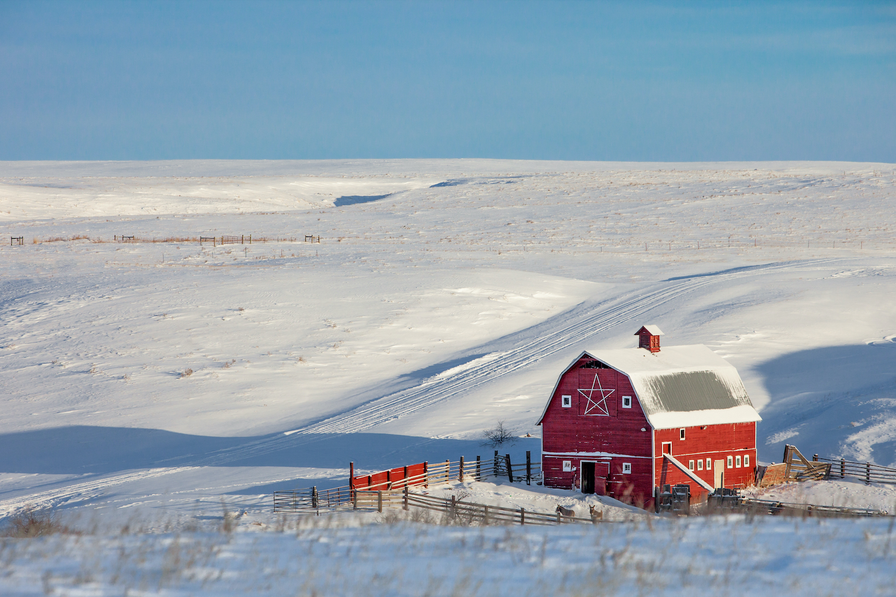

```{r setup, include=FALSE}
source("./R/setup.R")

```



## {- .tabset .tabset-fade .tabset-pills}

```{r load gridmet, cache=TRUE}
start_date <- "2019-12-01"
end_date <- "2020-02-29"

gridmet <- mtd_get_gridmet_ee(collection = "IDAHO_EPSCOR/GRIDMET",
                              vars = list("pr" = "sum",
                                          "tmmn" = "mean",
                                          "tmmx" = "mean"),
                              start_date = start_date,
                              end_date = end_date,
                              raw_dir = "../data/GRIDMET",
                              overwrite = FALSE)

# gridmet <- mtd_get_gridmet(dates = c(start_date, end_date),
#                            raw_dir = "../data/GRIDMET")

# gridmet$pr %<>%
#   mm_to_in()
# 
# gridmet$tmmn %<>%
#   k_to_f()
# 
# gridmet$tmmx %<>%
#   k_to_f()
# 
# normals <- 
#   readr::read_rds("../data/gridmet/normals/gridmet_normals.Rds") %>%
#   purrr::map(
#     function(x){
#       x %>%
#         purrr::map(function(i){
#           i[[lubridate::as_date(attr(gridmet,"dates")) %>%
#                lubridate::yday()]]
#         })
#     }
#   )
# 
# normals$precipitation_amount %<>%
#   purrr::map(raster::calc, fun = base::sum, na.rm = TRUE) %>%
#   raster::brick() %>%
#   mm_to_in()
# 
# normals$daily_minimum_temperature %<>%
#   purrr::map(raster::calc, fun = base::mean, na.rm = TRUE) %>%
#   raster::brick() %>%
#   k_to_f()
# 
# normals$daily_maximum_temperature %<>%
#   purrr::map(raster::calc, fun = base::mean, na.rm = TRUE) %>%
#   raster::brick() %>%
#   k_to_f()
# 
# normals_projected <- normals %>%
#   purrr::map(raster::projectRaster, gridmet$pr, method = "ngb")
# 
# # gridmet_plain <- gridmet
# gridmet <- gridmet_plain
# 
# gridmet$pr %<>%
#   as.list() %>%
#   c(
#     normals_projected$precipitation_amount %>% 
#       as.list()
#   ) %>%
#   raster::brick()
# 
# gridmet$tmmn %<>%
#   as.list() %>%
#   c(
#     normals_projected$daily_minimum_temperature %>% 
#       as.list()
#   ) %>%
#   raster::brick()
# 
# gridmet$tmmx %<>%
#   as.list() %>%
#   c(
#     normals_projected$daily_maximum_temperature %>% 
#       as.list()
#   ) %>%
#   raster::brick()


# test <- readr::read_rds("../data/gridmet/normals/precipitation_amount.Rds")
# 
# out <-
#   tibble::tibble(
#     rasts = 
#       test %>%
#       as.list(),
#     year = 
#       test %>%
#       names() %>%
#       stringr::str_remove("X") %>%
#       lubridate::as_date() %>%
#       lubridate::year(),
#     day = 
#       test %>%
#       names() %>%
#       stringr::str_remove("X") %>%
#       lubridate::as_date() %>%
#       lubridate::yday()
#   ) %>%
#   dplyr::filter(day %in% (seq(lubridate::as_date(start_date),
#                               lubridate::as_date(end_date),
#                               "1 day") %>%
#                            lubridate::yday())) %>%
#   dplyr::group_by(year) %>%
#   dplyr::summarise(
#     rasts = list(
#       list(
#         mean = rasts %>%
#           raster::brick() %>%
#           mean() %>%
#           magrittr::set_names("normal.mean"),
#         
#         quantile = rasts %>%
#           raster::brick() %>%
#           calc(fun = quantile, na.rm = TRUE) %>%
#           magrittr::set_names(c("normal.000",  "normal.025",  "normal.050",  "normal.075",  "normal.100"))
#       ) %>%
#         raster::brick())
#   )
# 
# 
# (out$rasts %>%
#     purrr::reduce(`+`) %>%
#     mm_to_in())[["mean"]] %>%
#   raster::plot()


gridmet_series <- mtd_get_gridmet_series_ee(collection = "IDAHO_EPSCOR/GRIDMET", 
                                            vars = c("pr", "tmmn", "tmmx"),
                                            start_date = "2019-10-01", 
                                            end_date = "2020-09-30")

gridmet_series$pr %<>%
  dplyr::mutate_at(.vars = dplyr::vars(value:normal.100),
                   .funs = mm_to_in)

gridmet_series$tmmn %<>%
  dplyr::mutate_at(.vars = dplyr::vars(value:normal.100),
                   .funs = k_to_f)

gridmet_series$tmmx %<>%
  dplyr::mutate_at(.vars = dplyr::vars(value:normal.100),
                   .funs = k_to_f)

gridmet_sf <- gridmet %>%
  mtd_as_sf_gridmet() %>%
  purrr::map(sf::st_intersection,
             y = mt_state_simple)
attr(gridmet_sf,"dates") <- attr(gridmet,"dates")

```

###  Temperature {-}

```{r past-seasonal-temp-grid-normals, collapse=TRUE, results='hold', message=FALSE, warning=FALSE, cache=TRUE}

gridmet_sf %>%
  mtd_plot_gridmet(element = "tmean",
                   use_normal = TRUE) %>%
  save_mt_map("review_temperature.pdf")

```

```{r past-seasonal-temp-grid-normals-leaflet, fig.height=5, collapse=TRUE, results='hold', message=FALSE, warning=FALSE, cache=FALSE, out.extra=''}

gridmet$tmean <- (gridmet$tmmn + gridmet$tmmx)/2
names(gridmet$tmean) <- names(gridmet$tmmn)

past_seasonal_temp <- (gridmet$tmean$layer - gridmet$tmean$normal.mean)
attr(past_seasonal_temp,"dates") <- attr(gridmet,"dates")

past_seasonal_temp_map <- 
  mcor::mco_leaflet(x = past_seasonal_temp,
              pal =  "-RdBu",
              legend_title = stringr::str_c(format(head(attr(past_seasonal_temp,"dates"), 1), '%B %d, %Y')," – ",
                                            format(tail(attr(past_seasonal_temp,"dates"), 1), '%B %d, %Y'),"<br>",
                                            "<a href='../reference.html' target='_blank'>Average temperature (ºF), deviation from normal</a>"),
              image_query_title = "Temperature Deviation (ºF)",
              reverse = TRUE,
              midpoint = 0,
              digits = 1)

past_seasonal_temp_map %>%
  saveWidgetFix("./figures/review_temperature.html", 
                selfcontained = FALSE,
                libdir = "./site_libs"
  )

knitr::include_url("./figures/review_temperature.html",
                   height = "500px")

```

<!-- <iframe id="review_temperature" src="./figures/review_temperature.html" width="100%" height="500px"> -->

Despite what felt like early onset of winter for most of the state, Montana has been warmer than average for much of December through February. The mountains of western Montana have experienced temperatures nearly 3ºF warmer than average, and only a couple places in far northern and southwestern Montana have experienced temperatures that are cooler than normal. Warm temperatures in the winter can lead to mid-season snow melt, causing high winter runoff and reducing the snowpack available later in the spring and early summer.

The graph below compares historical daily temperatures (shaded bands and dashed lines) to current daily temperatures so far in 2019 (solid-jagged lines) across Montana. The shaded bands represent the range of recorded temperatures during the 1981--2010 period on any given day. The red bands and lines represent the high temperatures and the blues bands and lines represent the lows. The dashed red and blue lines represent the average high and average low temperatures during the 1981--2010 period.


```{r past-seasonal-temp-grid-climatology, cache=FALSE}
mtd_plot_climatology(x = gridmet_series[c("tmmn","tmmx")],
                     col = c("#0571b0","#ca0020"),
                     ybreaks = seq(-25,100,25),
                     title = "Temperature (ºF)",
                     polar = FALSE,
                     smooth = TRUE,
                     mean = TRUE) +
  ggplot2::geom_line(ggplot2::aes(x = date,
                                  y = value),
                     col = "#0571b0",
                     data = gridmet_series$tmmn %>%
                       na.omit(),
                     na.rm = TRUE) +
  ggplot2::geom_line(ggplot2::aes(x = date,
                                  y = value),
                     col = "#ca0020",
                     data = gridmet_series$tmmx %>%
                       na.omit(),
                     na.rm = TRUE)

ggplot2::ggsave("./figures/review_temperature_climate.pdf")

```

###  Precipitation {-}

```{r past-seasonal-prcp-grid-normals, collapse=TRUE, results='hold', message=FALSE, warning=FALSE, cache=TRUE}

gridmet_sf %>%
  mtd_plot_gridmet(element = "prcp",
                   use_normal = TRUE) %>%
  save_mt_map("review_precipitation.pdf")

```


```{r past-seasonal-prcp-grid-normals-leaflet, fig.height=5, collapse=TRUE, results='hold', message=FALSE, warning=FALSE, cache=FALSE, out.extra=''}

past_seasonal_prcp <- (gridmet$pr$layer / gridmet$pr$normal.mean) %>%
  magrittr::multiply_by(100) %>%
  round()
attr(past_seasonal_prcp,"dates") <- attr(gridmet,"dates")


mcor::mco_leaflet(x = past_seasonal_prcp,
            pal =  "BrBG",
            legend_title = stringr::str_c(format(head(attr(past_seasonal_prcp,"dates"),1), '%B %d, %Y')," – ",
                                          format(tail(attr(past_seasonal_prcp,"dates"),1), '%B %d, %Y'),"<br>",
                                          "<a href='../reference.html' target='_blank'>Net precipitation, % of normal</a>"),
            image_query_title = "Net precipitation, percent of normal",
            reverse = TRUE,
            midpoint = 100,
            digits = 0) %>%
  saveWidgetFix("./figures/review_precipitation.html", 
                selfcontained = FALSE,
                libdir = "./site_libs")

knitr::include_url("./figures/review_precipitation.html",
                   height = "500px")
# addLogo("../img/MCO_logo.svg", 
#         src = "local", 
#         width = 200, 
#         position = "topright") %T>%
# 

```

<!-- <iframe id="review_precipitation" src="./figures/review_precipitation.html" width="100%" height="500px"> -->

December was very dry for most of Montana, which resulted in slightly below-normal precipitation across the state for December through February. However, in January and February Montana experienced a series of *atmospheric rivers*. Atmospheric rivers are narrow bands of concentrated moisture that originate over the Pacific Ocean and flow inland, releasing snow and rain. Areas that are under these rivers in the sky tend to see large amounts of precipitation, sometimes over long durations. If the current pattern of regular storms continues, snowpack and soil moisture will increase across the state.

The graph below compares historical daily precipitation (shaded band and dashed line) to current daily precipitation so far in 2019 (vertical bars) across Montana. The shaded band represent the range of recorded precipitation during the 1981--2010 period on any given day. The dashed line represents the average precipitation during the 1981--2010 period.

```{r past-seasonal-prcp-grid-climatology, cache=FALSE}
mtd_plot_climatology(x = gridmet_series[c("pr")],
                     col = c("forestgreen"),
                     ybreaks = seq(0,0.8,0.1),
                     title = "Precipitation (in.)",
                     polar = FALSE,
                     smooth = TRUE,
                     mean = TRUE,
                     family = tw()) +
  ggplot2::geom_col(mapping = ggplot2::aes(x = date,
                                           y = value),
                    col = "forestgreen",
                    data = gridmet_series$pr %>%
                      na.omit(),
                    na.rm = TRUE)

ggplot2::ggsave("./figures/review_precipitation_climate.pdf")

```

<!-- ### {width="35px"} Snowpack {-} -->

<!-- ```{r past-seasonal-swe, collapse=TRUE, message=FALSE, warning=FALSE, cache=FALSE, out.extra=''} -->
<!-- past_seasonal_swe <- mtd_plot_swe_basins(date = "2019-10-31", huc = 8) -->


<!-- knitr::include_url(past_seasonal_swe$leaflet$path, -->
<!--                    height = "500px") -->

<!-- ``` -->

<!-- <iframe id="past_seasonal_swe" src="./figures/2019-02-11-swe.html" width="100%" height="500px"> -->

<!-- Wet and warmer conditions across western Montana have accelerated snowmelt—most basins now have less snowpack than normal, ranging from ~11% of normal in the Yaak basin in far northwestern Montana to upward of 200% of normal in the Upper Tongue and Big Horn Lake basins. Several basins in central Montana remain slightly higher than normal thanks to exceptional snowpack and cooler temperatures earlier this spring. -->

<!-- ###  Soil Moisture {-} -->

<!-- ```{r past-seasonal-smap-grid, collapse=TRUE, results='hide', message=FALSE, warning=FALSE, cache=TRUE} -->
<!-- smap <- mtd_plot_smap(date = "2020-03-01", -->
<!--                       variable = "sm_rootzone_wetness", -->
<!--                       data_out = "../data/SMAP") -->

<!-- smap$map %>% -->
<!--   save_mt_map("review_soil_moisture.pdf") -->

<!-- ``` -->

<!-- ```{r past-seasonal-smap-grid-leaflet, fig.height=5, collapse=TRUE, results='hold', message=FALSE, warning=FALSE, cache=FALSE, out.extra=''} -->
<!-- smap$leaflet %>% -->
<!--   saveWidgetFix("./figures/review_soil_moisture.html", -->
<!--                 selfcontained = FALSE, -->
<!--                 libdir = "./site_libs" -->
<!--   ) -->

<!-- knitr::include_url("./figures/review_soil_moisture.html", -->
<!--                    height = "500px") -->

<!-- ``` -->

<!-- Cool temperatures and high precipitation have led to truly historic soil moisture conditions across central and eastern Montana going into the fall. Soils east of the continental divide are nearly saturated, and are likely to stay very wet into the winter. Impacts include increased flooding during fall snow storms, difficulty planting winter wheat, and the increased likelihood of significant flooding events and planting delays this coming spring as snow melts on frozen or saturated soils. As of early October, Montana producers had only sown 50% their intended winter wheat acreage and only 9% had emerged --- usually 75% has been sown by early October, with 35% emerged. Cool temperatures and the soil moisture surplus have continued to delay or prohibit fall planting. -->

### {width="35px"} Snowpack {-}

As of late February, snowpack is above normal across Montana. Snow Water Equivalent (SWE) values range from 101% of normal in Fisher basin to over 140% of normal in Judith basin. Like precipitation, snowpack was well below average into early January, but rebounded thanks to a series of strong winter storms. Mountain snowpack can be a good indicator of spring streamflow and the amount of water available for summer irrigation. It will be important to pay attention to spring temperatures, as a warmer spring can result in earlier snowmelt and flooding, and ultimately impact streamflow in mid-to-late summer.

```{r past-seasonal-swe, collapse=TRUE, results='hold', message=FALSE, warning=FALSE, cache=FALSE}
past_seasonal_swe <- mtd_plot_swe_basins(date = "2020-03-01", huc = 8)


knitr::include_url(past_seasonal_swe$leaflet$path,
height = "500px")

```


### {width="35px"} Drought {-}

```{r past-seasonal-drought, cache=TRUE}

past_seasonal_drought <- mtd_plot_usdm(date = "2020-03-01",
                                       data_out = "../data/USDM")

past_seasonal_drought$map %T>%
  save_mt_map("review_drought.pdf")

```

The US Drought Monitor has categorized an area around Great Falls as abnormally dry going into late winter. This aligns with persistent below-average precipitation in  this region. The location of storms from now until early spring will likely determine whether drought conditions are declared for area later this spring.
